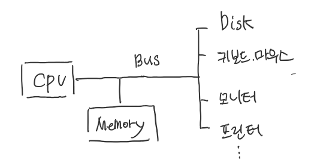
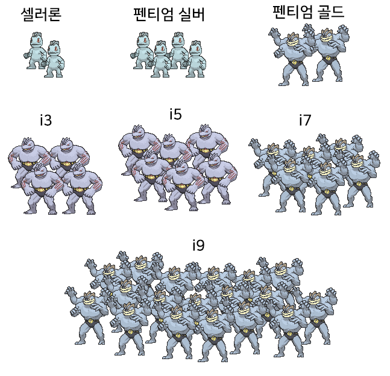
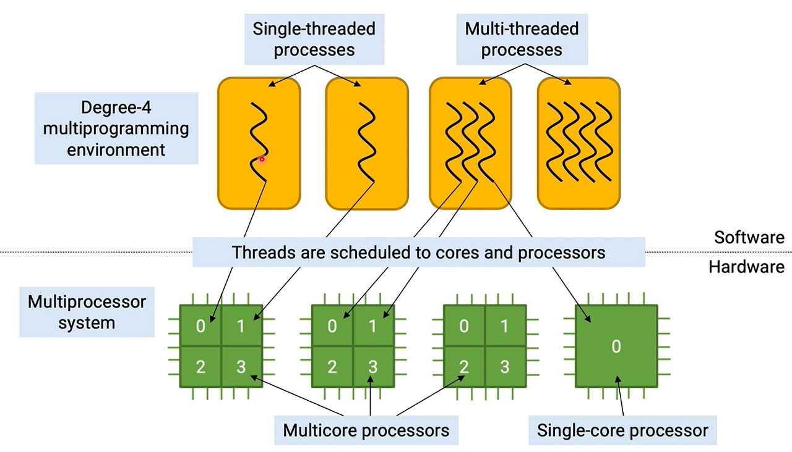

Table of Contents

- [컴퓨터 구조와 기능, CPU](#컴퓨터-구조와-기능,-CPU)

# 컴퓨터구조
## 컴퓨터 구조와 기능, CPU
   

컴퓨터 구조는 위 그림과 같이 4가지로 나눌 수 있다.
* CPU : 중앙처리장치. 데이터를 처리하는 역할
* Memory : 데이터를 저장하는 기능을 수행
* I/O : 컴퓨터와 외부장치 사이에 데이터를 교환하는 기능을 수행
* System Bus : 위의 모든 컴퓨터 시스템 구성요소들을 연결하여 데이터 전송을 수행   

컴퓨터의 기능 역시 크게 4가지로 나눌 수 있다.
* Data Processing : 데이터 연산
* Data Storage : 데이터 저장
* Data Movement : 데이터 통신, 이동
* Control : 제어(명령수행, 리소스 관리 등)   

### CPU (Central Processing Unit, 중앙 처리 장치)
컴퓨터에서 구성 단위 중 `기억, 해석, 연산, 제어`라는 4대 기능을 종합하는 중앙 처리 장치의 줄임말.   

### 프로세서
* 컴퓨터 운영을 위해 기본적인 명령어에 반응하고 처리하는 논리회로   
* 디바이스가 해야할 일을 총 지휘하는 프로세서를 CPU라고 함(보통 프로세서와 CPU를 같은 의미로 사용)   
* 이외의 프로세스는 제어장치(Control Unit), 연산장치(ALU)이 있다   

### 코어
코어란 각종 연산을 하는 **CPU 핵심요소**. 코어가 1개면 싱글코어, 2개면 듀얼코어, 4개면 쿼드코어라고 하며, 코어 수가 많을수록 병렬 처리 효율이 늘어날 수 있습니다.   

### CPU 세부 사항
다음은 8세대 이후 인텔 CPU를 비교한 그림입니다.   
   

몬스터는 코어수, 팔 개수는 스레드 수를 의미합니다.   

### 스레드
코어는 CPU를 물리적으로 구별한 것이고, 쓰레드는 CPU를 논리적으로 구별했다고 보면 됩니다. 일반적으로 코어개수와 CPU 개수는 같지만 인텔같은 경우 하이퍼쓰레딩(Hyper Threading) 기술로 코어의 갯수를 반으로 쪼개는 기술이 이용됩니다.

   

### 클럭
CPU를 비롯한 컴퓨터의 모든 부품들은 일정한 간격(속도0으로 발생되는 전기적 신호)에 맞춰 동작하는데 이 전기적 신호를 클럭이라고 합니다.

단순히 정리하면 클럭이 높을수록 CPU 연산속도가 빠르고 성능이 좋습니다. 하지만 클럭이 높을수록 열을 그만큼 많이 발생하겠죠. 따라서 CPU마다 적정선이 존재합니다.

참고로 오버클럭은 말 그대로 클럭 수치를 적정 클럭보다 오버시켜서 부품에 부여하는 것입니다.

### 참고 자료
[참고 자료 1](https://velog.io/@ckstn0777/%EC%BB%B4%ED%93%A8%ED%84%B0%EA%B5%AC%EC%A1%B0-%EC%BB%B4%ED%93%A8%ED%84%B0-%EA%B5%AC%EC%A1%B0%EC%99%80-%EA%B8%B0%EB%8A%A5-CPU) [참고 자료 2](https://donghoson.tistory.com/entry/CPU-%ED%94%84%EB%A1%9C%EC%84%B8%EC%84%9C-%EC%BD%94%EC%96%B4-%EA%B0%99%EC%9D%80-%EC%9A%A9%EC%96%B4%EC%9D%B8%EA%B0%80) [참고 자료 3](https://dmzld.tistory.com/18)