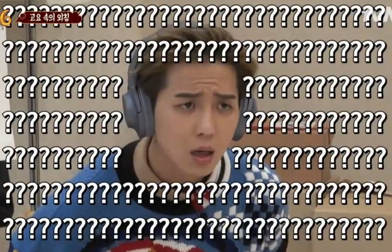

<details>
<summary>Table of Contents</summary>

- [SOLID](#solid)
- [factory pattern](#factory-pattern)

</details>

# SOLID   
## 객체지향 설계과정   
1. 요구사항 (제공해야 할 기능) 을 찾고 세분화 한다. 그리고 그 기능을 알맞은 객체로 할당한다.
2. 기능을 구현하는 데에 필요한 데이터를 객체에 추가한다.
3. 해당 데이터를 이용하는 기능을 구현한다. (기능은 최대한 캡슐화)
4. 객체 간에 어떻게 메소드 호출을 주고받을 지 결정한다.   

## 객체지향 설계원칙   
## SRP (Single Responsibility) 단일 책임 원칙   
- 클래스는 단 한개의 책임을 가져야 함
- 클래스를 변경하는 이유는 단 하나여야 함
- 이를 지키지 않으면, 한 책임의 변경에 의해 다른 책임과 관련된 코드에 영향을 미칠 수 있음.   

> SRP 에서 이야기하는 책임이란, '기능' 정도로 생각하면 된다. 만약 한 클래스가 수행할 수 있는 기능 (책임) 이 여러 개라면, 클래스 내부의 함수끼리 강한 결합을 발생할 가능성이 높아진다. 응집도는 높고 결합도는 낮은 프로그램을 설계하는 것이 비로소 객체지향 설계의 핵심인데, 이것이 위반되는 것이다. 새로운 요구사항이나 프로그램 변경에 의해 클래스 내부의 동작들이 연쇄적으로 변경되어야 할 수도 있다. 이는 유지보수가 비효율적이므로, 책임을 잘게 쪼개어 분리시킬 필요가 있다.  
 
### SRP 원칙 위반 예제와 수정하기   
1. 회계팀에서 급여를 계산하는 메서드
2. 인사팀에서 근무시간을 계산하는 메서드
3. 기술팀에서 변경된 정보를 DB에 저장하는 메서드
4. 초과 근무 시간을 계산하는 메서드 (회계팀과 인사팀에서 공유하며 사용)   

를 가지고 있는 `Employee` 클래스가 있다.   

```Java
class Employee {
    int totalOverTimeHours; // 초과 근무 시간

    Employee(String name, String position) {
        this.totalOverTimeHours = 0;
    }

	int calculatePay() {
        // 재무팀에서 사용
        // 초과 근무 수당 계산
        // 기존 수당에 overtimeHours의 3만원을 곱한 값을 리턴한다.
        return defaultPay + totalOverTimeHours * 30000;
    }
    
    int reportHours(int overTimeHours) {
        // 인사팀에서 사용
        // 초과 근무 시간 보고
        totalOverTimeHours += overTimeHours;
        return totalOverTimeHours;
    }
}
```   

인사팀에서 초과 근무 시간을 수정해야하는 일이 생겼다. 할 일은 많은데 CEO는 계속 초과 근무 시간을 줄이라고 하는 것이다. `reportHours()` 함수의 `return totalOverTimeHours;`를 `return totalOverTimeHours - 3;` 처럼 수정하면 괜찮지만 실수로 `Employee`생성자의 `this.totalOverTimeHours = 0`를 `this.totalOverTimeHours = -3;`으로 수정했다. 여기서 문제는 `totalOverTimeHours`는 재무팀에서도 사용하기 때문에 `calculatePay()`에도 영향이 미치게된다. 따라서 근로자는 실제로 초과 근무한 시간에서 3시간을 제외한 부분을 인정받게 된다.   

물론 바보 같은 실수라고 생각할 수 있지만, 실제 코딩을 하게되면 이런 실수가 종종 나온다. 이런 실수가 나오는 이유는 `Employee` 클래스가 재무팀, 인사팀 2개의 액터에 대한 책임을 가지고 있기 때문이다.   

> 액터는 시스템을 수행하는 역할을 하는 요소로써, 시스템을 이용하는 사용자, 하드웨어 혹은 외부 시스템이 될 수 있다.
회계팀, 인사팀, 기술팀에서 데이터를 얻기위해 하나의 Employee 클래스를 사용하기 때문에, 3개의 액터가 하나의 클래스를 변경할 수 있는 요인이 되어 SRP 원칙을 어긴 구조라고 하는 것이다.   

이를 해결하기 위해서는 인사팀과 재무팀 `totalOverTimeHours` 변수를 수정할 수 없게 만들면 된다.   

```java
// * 통합 사용 클래스
class EmployeeFacade {
    int totalOverTimeHours; // 초과 근무 시간

    Employee(String name, String position) {
        this.totalOverTimeHours = 0;
    }
    
    // * 급여를 계산하는 메서드 (재무팀 클래스를 불러와 에서 사용)
    int calculatePay() {
        // ...
        new PayCalculator().calculatePay(totalOverTimeHours);
        // ...
    }

    // * 근무시간을 계산하는 메서드 (인사팀 클래스를 불러와 에서 사용)
    int reportHours(int overTimes) {
        // ...
        new HourReporter().reportHours(overTimes, totalOverTimeHours);
        // ...
    }
}

// * 재무팀에서 사용되는 전용 클래스
class PayCalculator {
    
    int calculatePay(int totalOverTimeHours) {
        // ...
        return defaultPay + totalOverTimeHours * 30000;
    }
}

// * 인사팀에서 사용되는 전용 클래스
class HourReporter {

    int reportHours(int overTimeHours, int totalOverTimeHours) {
        // 인사팀에서 사용
        // 초과 근무 시간 보고
        totalOverTimeHours += overTimeHours;
        return totalOverTimeHours;
    }
}
```   

재무팀에서 사용하는 전용 클래스인 `PayCalculator`와 인사팀에서 사용하는 전용 클래스 `HourReporter`를 만들었다. 이제 재무팀과 인사팀은 `EmployeeFacade` 클래스를 사용하지 않으므로 `totalOverTimeHours`가 변경될 일이 없다.   

> 위와 같은 구성을 디자인 패턴중 하나인 Facade 패턴이라고 말한다.
Facade란 건물의 정면을 의미한다. Facade Pattern은 말 그대로 건물의 뒷부분이 어떻게 생겼는지는 보여주지 않고 건물의 정면만 보여주는 패턴이다.
예를들어 EmployeeFacade 클래스는 메서드의 구현이 어떻게 되어있는지는(건물의 뒷부분) 보여주지 않고
어떤 메서드가 있는지(건물의 정면)만 보여준다.
구체적인 메서드의 구현은 각각 PayCalculator, HourReporter, EmployeeSaver 클래스에 위임하기 때문이다.   
 

## OCP (Open-Closed Principle) 개방 폐쇄 원칙   
- 기존의 코드를 변경하지 않으면서, 기능을 추가할 수 있도록 설계가 되어야 한다는 원칙
- 확장(새로운 기능 추가)에 대해서는 개방적(open)이고 수정에 대해서는 폐쇄적(closed)이어야 한다는 의미
   
어렵게 생각할 필요 없이, OCP 원칙은 **추상화**를 의미한다고 생각하면 된다.   

### OCP 원칙 위반 예제와 수정하기   
```java
class Animal {
	String type;
    
    Animal(String type) {
    	this.type = type;
    }
}

// 동물 타입을 받아 각 동물에 맞춰 울음소리를 내게 하는 클래스 모듈
class HelloAnimal {
    void hello(Animal animal) {
        if(animal.type.equals("Cat")) {
            System.out.println("냐옹");
        } else if(animal.type.equals("Dog")) {
            System.out.println("멍멍");
        }
    }
}

public class Main {
    public static void main(String[] args) {
        HelloAnimal hello = new HelloAnimal();
        
        Animal cat = new Animal("Cat");
        Animal dog = new Animal("Dog");

        hello.hello(cat); // 냐옹
        hello.hello(dog); // 멍멍
    }
}
```   

만약 '양'이나 '사자'를 추가하게 된다면 어떻게 될까?
HelloAnimal 클래스를 수정해줘야 한다.   

```java
public class Main {
    public static void main(String[] args) {
        HelloAnimal hello = new HelloAnimal();

        Animal cat = new Animal("Cat");
        Animal dog = new Animal("Dog");

        Animal sheep = new Animal("Sheep");
        Animal lion = new Animal("Lion");

        hello.hello(cat); // 냐옹
        hello.hello(dog); // 멍멍
        hello.hello(sheep); 
        hello.hello(lion);
    }
}

class HelloAnimal {
    // 기능을 확장하기 위해서는 클래스 내부 구성을 일일히 수정해야 하는 번거로움이 생긴다.
    void hello(Animal animal) {
        if (animal.type.equals("Cat")) {
            System.out.println("냐옹");
        } else if (animal.type.equals("Dog")) {
            System.out.println("멍멍");
        } else if (animal.type.equals("Sheep")) {
            System.out.println("메에에");
        } else if (animal.type.equals("Lion")) {
            System.out.println("어흥");
        }
        // ...
    }
}
```   

이런식으로 코드를 구성한다면, 동물이 추가될 때마다 계속 코드를 일일이 변경해줘야 한다.   

OCP 설계 원칙에 따라 적절한 추상화 클래스를 구성하고 이를 상속하여 확장시키는 관계로 구성하면 변경에는 닫히고 추가에는 열려있는 프로그램을 만들 수 있다.   

어떤 식으로 OCP대로 추상화 설계를 할 것인가에 대해서는 다음 규칙대로 이행하면 된다.   
1. 먼저 변경(확장)될 것과 변하지 않을 것을 엄격히 구분한다.
2. 이 두 모듈이 만나는 지점에 추상화(추상클래스 or 인터페이스)를 정의한다.
3. 구현체에 의존하기보다 정의된 추상화에 의존하도록 코드를 작성한다.   
   

```java
// 추상화
abstract class Animal {
    abstract void speak();
}

class Cat extends Animal { // 상속
    void speak() {
        System.out.println("냐옹");
    }
}

class Dog extends Animal { // 상속
    void speak() {
        System.out.println("멍멍");
    }
}

class HelloAnimal {
    void hello(Animal animal) {
        animal.speak();
    }
}

public class Main {
    public static void main(String[] args) {
        HelloAnimal hello = new HelloAnimal();

        Animal cat = new Cat();
        Animal dog = new Dog();

        hello.hello(cat); // 냐옹
        hello.hello(dog); // 멍멍
    }
}
```   

위와 같이 구성하게 되면 기능 추가가 되었을때도 코드 수정 없이 확장이 가능하게 된다.   

따라서 다음과 같이 양 클래스와 사자 클래스를 추가할 때 HelloAnimal 클래스의 코드 수정 없이 정상적으로 기능 확장이 되는 것을 보여주게 된다.   
```java
// 추상클래스를 상속만 하면 메소드 강제 구현 규칙으로 규격화만 하면 확장에 제한 없다 (opened)
class Sheep extends Animal {
    void speak() {
        System.out.println("매에에");
    }
}

class Lion extends Animal {
    void speak() {
        System.out.println("어흥");
    }
}

// 기능 확장으로 인한 클래스가 추가되어도, 더이상 수정할 필요가 없어진다 (closed)
class HelloAnimal {
    void hello(Animal animal) {
        animal.speak();
    }
}

public class Main {
    public static void main(String[] args) {
        HelloAnimal hello = new HelloAnimal();

        Animal cat = new Cat();
        Animal dog = new Dog();

        Animal sheep = new Sheep();
        Animal lion = new Lion();

        hello.hello(cat); // 냐옹
        hello.hello(dog); // 멍멍
        hello.hello(sheep); // 매에에
        hello.hello(lion); // 어흥
    }
}
```   

## LSP (Liskov Substitution Principle) 리스코프 치환 원칙   
> 리스코프 치환 원칙은 1988년 바바라 리스코프(Barbara Liskov)가 올바른 상속 관계의 특징을 정의하기 위해 발표한 것으로, **서브 타입은 언제나 기반 타입으로 교체할 수 있어야 한다**는 것을 뜻한다. 교체할 수 있다는 말은, 자식 클래스는 최소한 자신의 부모 클래스에서 가능한 행위는 수행이 보장되어야 한다는 의미이다. 즉, **부모 클래스의 인스턴스를 사용하는 위치에 자식 클래스의 인스턴스를 대신 사용했을 때 코드가 원래 의도대로 작동해야 한다**는 의미이다. 이것을 부모 클래스와 자식 클래스 사이의 행위가 일관성이 있다고 말한다.   

### 리스코프 치환 원칙을 위반한 코드   
```java
public class Rectangle {
    private int width;
    private int height;

    public void setWidth(final int width) {
        this.width = width;
    }

    public void setHeight(final int height) {
        this.height = height;
    }

    public int getWidth() {
        return width;
    }

    public int getHeight() {
        return height;
    }
    
    public int getArea() {
        return width * height;
    }
}
```   

위 `Rectangle` 객체를 상속받아서 정사각형 객체를 정의할 수 있다.   

```java
public class Square extends Rectangle {

    @Override
    public void setWidth(final int width) {
        super.setWidth(width);
        super.setHeight(width);
    }

    @Override
    public void setHeight(final int height) {
        super.setWidth(height);
        super.setHeight(height);
    }
}
```   

다만, 정사각형은 가로와 세로의 길이가 같으므로 setWidth()나 setHeight()를 호출하면 가로와 세로를 모두 값을 바꿔줘야해서 메소드를 재정의했다.   

`Rectangle`의 넓이를 구해보자.    
```java
public class Main
{
    public static void main(String[] args)
    {
        Rectangle rectangle = new Rectangle();
        rectangle.setWidth(10);
        rectangle.setHeight(5);
        
        System.out.println(rectangle.getArea());
    }
}
```   

    50   

`Rectangle`의 넓이를 구하는 소스는 이와 같다. 너비가 10, 높이가 5로 할당됐으므로 넓이 50이 정상적으로 반환된다.

리스코프 치환 원칙에 의하면, 자식 객체는 부모 객체를 완전히 대체할 수 있다고 했으므로, `Rectangle`을 상속받은 `Square`로 대체하여 넓이를 구해보자.

`Square`가 `Rectangle`을 완전히 대체했다면 동일한 결과인 50이 반환되어야 한다.   

```java
public class Main { 
    public static void main(String[] args) {
        Rectangle rectangle = new Square();
        rectangle.setWidth(10);
        rectangle.setHeight(5);
	        
        System.out.println(rectangle.getArea());
    }
}
```   
    25   

어째서인지 넓이는 50이 아닌 25로 반환됐다. 자세히 살펴보니, 마지막에 수행된 setHeight(5)가 객체의 너비/높이를 모두 5로 할당했다. 그러니 넓이도 당연히 25가 출력될 수밖에 없었던 걸로 보인다. 즉, 이 객체는 리스코프 치환 원칙에 위배되는 코드다.

곰곰히 생각해보면, 직사각형과 정사각형은 상속관계가 전혀 될 수 없다. 사각형의 특징을 서로 갖고있긴 하지만, 두 사각형 모두 사각형의 한 종류일 뿐으로, 하나가 다른 하나를 완전히 포함하지 못 하는 구조다.

이렇게 잘못된 객체를 상속하거나, 올바르게 확장하지 못 할 경우 겉으로 보기엔 정상적이지만 올바른 객체는 아니다.   

### 리스코프 치환 원칙을 준수한 코드   
직사각형과 정사각형은 상속의 관계가 성립하기 어렵다. 따라서 이보다 상위 개념인 사각형 객체를 구현하고 정사각형, 직사각형이 이를 상속받으면 될 것이다.   

```java
public class Shape
{
    protected int width;
    protected int height;
    
    public int getWidth()
    {
        return width;
    }
    
    public int getHeight()
    {
        return height;
    }
    
    public void setWidth(int width)
    {
        this.width = width;
    }
    
    public void setHeight(int height)
    {
        this.height = height;
    }
    
    public int getArea()
    {
        return width * height;
    }
}

```   

위와 같이 `Shape`라는 사각형 객체를 구현한다.   

```java
class Rectangle extends Shape
{
    public Rectangle(int width, int height)
    {
        setWidth(width);
        setHeight(height);
    }
}

class Square extends Shape
{
    public Square(int length)
    {
        setWidth(length);
        setHeight(length);
    }
}
```   

`Shape`를 상속받는 두 사각형 `Rectangle`과 `Square` 객체는 위와 같다. `Rectangle` 객체는 인스턴스 생성 시 `width`와 `height`를 파라미터로 받으며, `Square`는 각 변의 길이가 동일하므로 `lenght` 하나만을 파라미터로 받는다.   

```java
public class Main
{
    public static void main(String[] args)
    {
        Shape rectangle = new Rectangle(10, 5);
        Shape square = new Square(5);
        System.out.println(rectangle.getArea());
        System.out.println(square.getArea());
    }
}
```   

    50
    25   

이제 `Rectangle`과 `Square`가 상속 관계가 아니므로, 리스코프 치환 원칙을 더 이상 위반하지 않는다.   

리스코프 치환 원칙은 상속되는 객체는 반드시 부모 객체를 완전히 대체해도 아무런 문제가 없도록 권고한다. 위의 직사각형과 정사각형의 케이스처럼 올바르지 못한 상속관계는 제거하고, 부모 객체의 동작을 완벽하게 대체할 수 있는 관계만 상속하도록 코드를 설계해야한다.

리스코프 치환 원칙을 지키기 위해선 가급적 부모 객체의 일반 메소드를 그 의도와 다르게 오버라이딩 하지 않는 것이 중요하다.

부모 객체의 오버라이딩은 주로 동일한 메소드를 자식 객체만의 동작을 추가하기 위해 한다는 걸 감안하면 매우 준수하기 까다로운 원칙.    

## ISP (Interface Segregation Principle) 인터페이스 분리 원칙   
> 범용적인 인터페이스 보다는 클라이언트가 실제로 사용하는 인터페이스를 만들어야 한다는 의미. 즉, 인터페이스를 사용에 맞게끔 각기 분리해야한다.    

만약 인터페이스의 추상 메서드들을 범용적으로 이것저것 구현한다면, 그 인터페이스를 상속받은 클래스는 자신이 사용하지 않는 인터페이스마저 억지로 구현 해야 하는 상황이 올 수도 있다. 또한 사용하지도 않는 인터페이스의 추상 메소드가 변경된다면 클래스에서도 수정이 필요하게 된다.   

즉, 인터페이스 분리 원칙이란 인터페이스를 잘게 분리함으로써, 클라이언트의 목적과 용도에 적합한 인터페이스 만을 제공하는 것이다.

### ISP 원칙 위반 예제와 수정하기   
스마트폰 클래스를 구현하기 위해 인터페이스로 스마트폰을 추상화 하였다.   
```java
interface ISmartPhone {
    void call(String number); // 통화 기능
    void message(String number, String text); // 문제 메세지 전송 기능
    void wirelessCharge(); // 무선 충전 기능
    void AR(); // 증강 현실(AR) 기능
    void biometrics(); // 생체 인식 기능
}
```   

만약 갤럭시 S20이나 S21 클래스를 구현한다면, 최신 스마트폰 기종인 만큼 객체의 동작 모두가 필요하므로 ISP 원칙을 만족하게 된다.   

```java
class S20 implements ISmartPhone {
    public void call(String number) {
    }

    public void message(String number, String text) {
    }

    public void wirelessCharge() {
    }

    public void AR() {
    }

    public void biometrics() {
    }
}

class S21 implements ISmartPhone {
    public void call(String number) {
    }

    public void message(String number, String text) {
    }

    public void wirelessCharge() {
    }

    public void AR() {
    }

    public void biometrics() {
    }
}
```   

갤럭시 S3에는 무선 충전, 생체인식과 같은 기능은 포함되어 있지 않기 때문에 갤럭시 S3가 위의 인터페이스를 상속받는다면 문제가 생긴다.   

인터페이스 규칙상 오버라이딩은 하되, 메서드 내부는 빈공간으로 두거나 예외를 발생토록 구성해야 한다.   

```java
class S3 implements ISmartPhone {
    public void call(String number) {
    }

    public void message(String number, String text) {
    }

    public void wirelessCharge() {
        System.out.println("지원 하지 않는 기능 입니다.");
    }

    public void AR() {
        System.out.println("지원 하지 않는 기능 입니다.");
    }

    public void biometrics() {
        System.out.println("지원 하지 않는 기능 입니다.");
    }
}
```   

해결 방법은 각각의 기능에 맞게 인터페이스를 잘게 분리하면 된다.   

```java
interface IPhone {
    void call(String number); // 통화 기능
    void message(String number, String text); // 문제 메세지 전송 기능
}

interface WirelessChargable {
    void wirelessCharge(); // 무선 충전 기능
}

interface ARable {
    void AR(); // 증강 현실(AR) 기능
}

interface Biometricsable {
    void biometrics(); // 생체 인식 기능
}

class S21 implements IPhone, WirelessChargable, ARable, Biometricsable {
    public void call(String number) {
    }

    public void message(String number, String text) {
    }

    public void wirelessCharge() {
    }

    public void AR() {
    }

    public void biometrics() {
    }
}

class S3 implements IPhone {
    public void call(String number) {
    }

    public void message(String number, String text) {
    }
}
```   

## DIP (Dependency inversion principle) 의존관계 역전 원칙   
> 객체는 구체적인 객체가 아닌 추상화에 의존해야 한다는 법칙   
   
 

아니 뭔소리야 도대체??? 예제로 알아보자.   
```java
class Programmer {
  private Americano _americano;
  
  public Programmer() {
    _americano = new Americano();
  }
  
  public void drink() {
    _americano.drink();
  }
}

class Americano {
  public void drink() {
    System.out.println("Drink Americano");
  }
}
```   

여기 프로그래머와 아메리카노 클래스가 있다. 프로그래머는 커피를 달고 사므로 private 프로퍼티로 Americano를 가지고 있다. 또한 Programmer라는 클래스 내에서 `_americano.drink()`라고 Americano 클래스를 사용하고 있다. 이때 Americano는 Programmer에 의존 관계(Americano가 변하면 Programmer도 변해야한다.)가 생기게 된다. 지금 당장은 이 코드가 아무 문제가 없어보일 수 있다.

만약 프로그래머가 아메리카노가 질려서 라떼를 마시고 싶다고 해보자. 그렇다면 위의 코드는 어떻게 바뀌어야 하는가?   

```java
class Programmer {
  private Latte _latte; // 아메리카노 -> 라떼로 변경
  
  public Programmer() {
    _latte = new Latte(); // 아메리카노 -> 라떼로 변경
  }
  
  public void drink() {
      _lattee.drinkLatte(); // 커피 종류마다 drink~ 메서드의 이름이 다르다면? 
														//관리하기 어려울게 뻔하다.
  }
}

class Americano {
  public void drink() {
    System.out.println("Drink Americano");
  }
}

class Latte {
  public void drinkLatte() { 
    System.out.println("Drink Latte");
  }
}
```   
1. 의존 관계 많이 가질 경우 (라떼 말고도 카페모카, 아인슈페너 등등의 메뉴가 추가될 경우) 관리하기가 어렵다.
2. 변경 사항이 있을 경우 이를 수정하기가 쉽지 않다.(라떼만 마시는 메서드 이름이 변할 경우 라떼, 프로그래머 클래스에서 사용되는 마시는 메서드 이름을 바꿔야 한다. 만약 모든 커피 클래스에 사이즈업 메서드가 추가된다면…?)   

그러면 어떻게 해결할까?   
```java
interface Coffee { // 커피라는 인터페이스를 만든다.
  public void drink();
}

class Americano implements Coffee {
  @Override
  public void drink() { 
    System.out.println("Drink Americano");
  }
}

class Latte implements Coffee {
  @Override
  public void drink() {
    System.out.println("Drink Americano");
  }
}
```   

```java
class Programmer {
  private Coffee _coffee;
  
  public Programmer(Coffee coffee) { // 1. Programmer(Americano())
    _coffee = coffee;
  }
  
  public void drink() { // 2.
    _coffee.drink();
  }
}
```   

Coffee 인터페이스를 만들었다. 이렇게 되면 Programmer는 Coffee Interface만 알고 있으면 된다. Coffee는 추상적 (구체적이지 않은 것) 이다.

아메리카노, 라떼처럼 구체적인 것에 의존하게 되면 유지보수가 어렵기 때문에 Coffee처럼 `추상적인 것에 의존`해야한다는 것이 바.로 D I P 이다. (aka 의존성 역전 법칙 ㅎㅎ)   

프로그래머가 아메리카노, 콜드 브루, 라떼, 바닐라 라떼의 존재를 아는가?

아니! 전혀 모른다!!!!! 

자자자, 여기서 Coffee 인터페이스를 상속받은 에스프레소를 추가한다고 해보자. Programmer 클래스에 변화가 생기는가? 아니, 전혀 아니다!


## 참고 자료   
[https://velog.io/@haero_kim/SOLID-%EC%9B%90%EC%B9%99-%EC%96%B4%EB%A0%B5%EC%A7%80-%EC%95%8A%EB%8B%A4](https://velog.io/@haero_kim/SOLID-%EC%9B%90%EC%B9%99-%EC%96%B4%EB%A0%B5%EC%A7%80-%EC%95%8A%EB%8B%A4)   

[https://inpa.tistory.com/entry/OOP-%F0%9F%92%A0-%EC%95%84%EC%A3%BC-%EC%89%BD%EA%B2%8C-%EC%9D%B4%ED%95%B4%ED%95%98%EB%8A%94-SRP-%EB%8B%A8%EC%9D%BC-%EC%B1%85%EC%9E%84-%EC%9B%90%EC%B9%99](https://inpa.tistory.com/entry/OOP-%F0%9F%92%A0-%EC%95%84%EC%A3%BC-%EC%89%BD%EA%B2%8C-%EC%9D%B4%ED%95%B4%ED%95%98%EB%8A%94-SRP-%EB%8B%A8%EC%9D%BC-%EC%B1%85%EC%9E%84-%EC%9B%90%EC%B9%99)   

[https://selfish-developer.com/entry/SRP-Single-Responsibility-Principle](https://selfish-developer.com/entry/SRP-Single-Responsibility-Principle)   

[https://inpa.tistory.com/entry/OOP-%F0%9F%92%A0-%EC%95%84%EC%A3%BC-%EC%89%BD%EA%B2%8C-%EC%9D%B4%ED%95%B4%ED%95%98%EB%8A%94-OCP-%EA%B0%9C%EB%B0%A9-%ED%8F%90%EC%87%84-%EC%9B%90%EC%B9%99](https://inpa.tistory.com/entry/OOP-%F0%9F%92%A0-%EC%95%84%EC%A3%BC-%EC%89%BD%EA%B2%8C-%EC%9D%B4%ED%95%B4%ED%95%98%EB%8A%94-OCP-%EA%B0%9C%EB%B0%A9-%ED%8F%90%EC%87%84-%EC%9B%90%EC%B9%99)   

[https://inpa.tistory.com/entry/OOP-%F0%9F%92%A0-%EC%95%84%EC%A3%BC-%EC%89%BD%EA%B2%8C-%EC%9D%B4%ED%95%B4%ED%95%98%EB%8A%94-LSP-%EB%A6%AC%EC%8A%A4%EC%BD%94%ED%94%84-%EC%B9%98%ED%99%98-%EC%9B%90%EC%B9%99](https://inpa.tistory.com/entry/OOP-%F0%9F%92%A0-%EC%95%84%EC%A3%BC-%EC%89%BD%EA%B2%8C-%EC%9D%B4%ED%95%B4%ED%95%98%EB%8A%94-LSP-%EB%A6%AC%EC%8A%A4%EC%BD%94%ED%94%84-%EC%B9%98%ED%99%98-%EC%9B%90%EC%B9%99)    

[https://blog.itcode.dev/posts/2021/08/15/liskov-subsitution-principle](https://blog.itcode.dev/posts/2021/08/15/liskov-subsitution-principle)   

[https://steady-coding.tistory.com/383](https://steady-coding.tistory.com/383)   

[https://inpa.tistory.com/entry/OOP-%F0%9F%92%A0-%EC%95%84%EC%A3%BC-%EC%89%BD%EA%B2%8C-%EC%9D%B4%ED%95%B4%ED%95%98%EB%8A%94-ISP-%EC%9D%B8%ED%84%B0%ED%8E%98%EC%9D%B4%EC%8A%A4-%EB%B6%84%EB%A6%AC-%EC%9B%90%EC%B9%99](https://inpa.tistory.com/entry/OOP-%F0%9F%92%A0-%EC%95%84%EC%A3%BC-%EC%89%BD%EA%B2%8C-%EC%9D%B4%ED%95%B4%ED%95%98%EB%8A%94-ISP-%EC%9D%B8%ED%84%B0%ED%8E%98%EC%9D%B4%EC%8A%A4-%EB%B6%84%EB%A6%AC-%EC%9B%90%EC%B9%99)   


## 싱글톤 패턴이란?

싱글톤(Singleton) 패턴의 정의는 단순하다. 인스턴스가 오직 1개만 생성되는 패턴을 의미한다.

---

### 싱글톤 패턴의 장단점
> 장점
1. 메모리 낭비를 방지할 수 있다.(한번만 생성하기때문에)
2. 싱글톤으로 만들어진 클래스와 다른 클래스의 인스턴스들의 데이터 공유가 쉽다.
>(싱글톤 인스턴스가 전역으로 사용되는 인스턴스이기 때문에 다른 클래스의 인스턴스들이 접근하여 사용할 수 있다.)
3. 인스턴스가 절대적으로 한개만 존재하는 것을 보증하기에 개발 시 실수를 줄일 수 있다.
4. 싱글톤 객체를 사용하지 않는 경우 인스턴스를 생성하지 않는다.
5. 싱글톤을 상속시킬 수 있다.

> 단점
1. 전역변수보다 사용하기가 불편하다.
2. 싱글톤의 역할이 커질수록 결합도가 높아져 객체 지향 설계 원칙에 어긋날 수 있다.(
3. 멀티쓰레드 환경에서 컨트롤이 어렵다.
4. 코드의 양이 많아진다.
5. 자식클래스를 만들수 없다는 점과, 내부 상태를 변경하기 어렵다는 점이 있다.

---
### 싱글톤 사용 예제


**이른 초기화**
```
public class Singleton {

    private static Singleton instance = new Singleton();
	
    private Singleton() {} //생성자를 private로
	
    public static Singleton getInstance() {
        return instance;
    }
}
```

- 이른 초기화는 클래스가 호출될 때 인스턴스를 생성하는 방법입니다. 다만 인스턴스를 사용하지 않아도 생성하기 때문에 효율성이 떨어집니다.


**늦은 초기화**

```
public class Singleton {

    private static Singleton instance;
	
    private Singleton () {} //생성자를 private로
	
    public static Singleton getInstance() {
        if (instance == null){
            instance = new Singleton();
        }    
        
        return instance;
    }
}
```
- 늦은 초기화는 인스턴스를 실제로 사용할 시점에 생성하는 방법입니다. 인스턴스를 실제로 생성하지 않으면 생성하지 않기에 이른 초기화보다 효율성이 좋다.
  하지만
  두 스레드가 동시에 싱글톤 인스턴스에 접근하고 생성이 안된 것을 확인하여 생성한다면 중복으로 생성하는 경우가 생길 수 있다.(동시성 문제 synchronized 키워드를 통해 해결가능하지만 대략 50~200배 느려진다.)
---   


# factory pattern
## 템플릿 메서드 패턴이란?
> 특정 작업을 처리하는 일부분을 서브 클래스로 캡슐화하여 전체적인 구조는 바꾸지 않으면서 특정 단계에서 수행하는 내용을 바꾸는 패턴
 
### 예시
```java
//추상 클래스 선생님
abstract class Teacher{
	
    public void start_class() {
        inside();
        attendance();
        teach();
        outside();
    }
	
    // 공통 메서드
    public void inside() {
        System.out.println("선생님이 강의실로 들어옵니다.");
    }
    
    public void attendance() {
        System.out.println("선생님이 출석을 부릅니다.");
    }
    
    public void outside() {
        System.out.println("선생님이 강의실을 나갑니다.");
    }
    
    // 추상 메서드
    abstract void teach();
}
 
// 국어 선생님
class Korean_Teacher extends Teacher{
    
    @Override
    public void teach() {
        System.out.println("선생님이 국어를 수업합니다.");
    }
}
 
//수학 선생님
class Math_Teacher extends Teacher{

    @Override
    public void teach() {
        System.out.println("선생님이 수학을 수업합니다.");
    }
}

//영어 선생님
class English_Teacher extends Teacher{

    @Override
    public void teach() {
        System.out.println("선생님이 영어를 수업합니다.");
    }
}

public class Main {
    public static void main(String[] args) {
        Korean_Teacher kr = new Korean_Teacher(); //국어
        Math_Teacher mt = new Math_Teacher(); //수학
        English_Teacher en = new English_Teacher(); //영어
        
        kr.start_class();
        System.out.println("----------------------------");
        mt.start_class();
        System.out.println("----------------------------");
        en.start_class();
    }
}
```

## 팩토리 메서드 패턴
> 팩토리 메소드 패턴에서는 객체를 생성하기 위한 인터페이스를 정의하는데, 어떤 클래스의 인스턴스를 만들지는 서브 클래스에서 결정하게 만드는 패턴이다.   
 
### 팩토리 메서드 패턴 VS 템플릿 메서드 패턴
> 인스턴스를 생성하는 공장을 Template Method 패턴으로 구성한 것이 Factory Method 패턴이다.

### 팩토리 메서드 패턴 사용 시기
* 클래스 생성과 사용의 처리 로직을 분리하여 결합도를 낮추고자 할 때
* 코드가 동작해야 하는 객체의 유형과 종속성을 캡슐화를 통해 정보 은닉 처리 할 경우
* 라이브러리 혹은 프레임워크 사용자에게 구성 요소를 확장하는 방법을 제공하려는 경우
* 기존 객체를 재구성하는 대신 기존 객체를 재사용하여 리소스를 절약하고자 하는 경우
  * 상황에 따라 적절한 객체를 생성하는 코드는 자주 중복될 수 있다. 그리고 객체 생성 방식의 변화는 해당되는 모든 코드 부분을 변경해야 하는 문제가 발생한다.
  * 따라서 객체의 생성 코드를 별도의 클래스 / 메서드로 분리 함으로써 객체 생성의 변화에 대해 대비를 하기 위해 팩토리 메서드 패턴을 이용한다고 보면 된다.
  * 특정 기능의 구현은 별개의 클래스로 제공되는 것이 바람직한 설계이기 때문이다.

### 장점
* 생성자(Creator)와 구현 객체(concrete product)의 강한 결합을 피할 수 있다.
* 팩토리 메서드를 통해 객체의 생성 후 공통으로 할 일을 수행하도록 지정해줄 수 있다.
* 캡슐화, 추상화를 통해 생성되는 객체의 구체적인 타입을 감출 수 있다.
* 단일 책임 원칙 준수 : 객체 생성 코드를 한 곳 (패키지, 클래스 등)으로 이동하여 코드를 유지보수하기 쉽게 할수 있으므로 원칙을 만족
* 개방/폐쇄 원칙 준수 : 기존 코드를 수정하지 않고 새로운 유형의 제품 인스턴스를 * 프로그램에 도입할 수 있어 원칙을 만족 (확장성 있는 전체 프로젝트 구성이 가능)
* 생성에 대한 인터페이스 부분과 생성에 대한 구현 부분을 따로 나뉘었기 때문에 패키지 분리하여 개별로 여러 개발자가 협업을 통해 개발   

### 단점
* 각 제품 구현체마다 팩토리 객체들을 모두 구현해주어야 하기 때문에, 구현체가 늘어날때 마다 팩토리 클래스가 증가하여 서브 클래스 수가 폭발한다.
* 코드의 복잡성이 증가한다.

### 1. 심플 팩토리 메서드 적용
```java
// 제품 객체
class Ship {
  String name, color, capacity;

  @Override
  public String toString() {
    return String.format("Ship { name: '%s', color: '%s', logo: '%s' }\n", name, color, capacity);
  }
}

class ContainerShip extends Ship {
  ContainerShip() {
    name = "ContainerShip";
    capacity = "20t";
    color = "green";
  }
}

class OilTankerShip extends Ship {
  OilTankerShip() {
    name = "OilTankerShip";
    capacity = "15t";
    color = "blue";
  }
}
```

```java
// 공장 객체
class ShipFactory {

  final Ship orderShip(String name, String email) {
    validate(name, email);

    Ship ship = createShip(name); // 선박 객체 생성

    sendEmailTo(email, ship);

    return ship;
  }

  private Ship createShip(String name) {
    Ship ship = null;
    if (name.equalsIgnoreCase("ContainerShip")) {
      ship = new ContainerShip();
    } else if (name.equalsIgnoreCase("OilTankerShip")) {
      ship = new OilTankerShip();
    }
    return ship;
  }

  private void validate(String name, String email) {
    if (name == null) {
      throw new IllegalArgumentException("배 이름을 지어주세요");
    }
    if (email == null) {
      throw new IllegalArgumentException("이메일을 남겨주세요");
    }
  }

  private void sendEmailTo(String email, Ship ship) {
    System.out.println(ship.name + " 다 만들었다고 " + email + "로 메일을 보냈습니다.");
  }
}
```

```java
class Client {
    public static void main(String[] args) {
        ShipFactory factory = new ShipFactory();

        Ship containerShip = factory.orderShip("ContainerShip", "inpa.naver.com");
        System.out.println(containerShip);

        Ship oilTankerShip = factory.orderShip("OilTankerShip", "inpa.naver.com");
        System.out.println(oilTankerShip);
    }
}
```   

하지만 아무리 객체 생성을 공장 클래스로 위임했더라도, 공장 클래스 내에서 여전히 분기 로직이 잔존해 있다.

즉, 확장엔 열려있고 수정엔 닫힌 개방-폐쇄 원칙을 만족하지 못하게 된다. 따라서 새로운 종류의 배를 만든다거나 배를 만드는 공정을 변경할 수 있으면서도 기존에 작성했던 코드를 유지할 수 있는 구조로 변경해야 한다.

### 2. 추상 팩토리 메서드 패턴 적용
잔존해 있는 분기문을 제거하고 객체 지향으로 팩토리를 구성해보자.

먼저 ShipFactory 클래스를 추상 클래스로 변환하고 Ship 인스턴스 생성을 책임지는 createShip() 메서드를 추상 메서드로 추상화 시킨다. 그리고 각 선박 종류에 맞게 ShipFactory 클래스를 상속하는 서브 팩토리 클래스들을 만들고 createShip() 추상 메서드를 각 객체 특징에 맞게 재정의 하도록 한다.

즉, orderShip() 메서드의 공통 코드는 냅두고 Ship 인스턴스를 만드는 작업 코드는 서브 클래스가 결정하도록 하는 것이다. (어찌 보면 템플릿 메서드와 결이 비슷하다 라고 볼 수 있다)

또한 공장 생성 메소드 내부에서는 필요한 동작을 자유롭게 구현할 수 있는데, 인자를 받거나 상태에 따라서 생성할 객체를 바꿀 수도 있다. 이렇게 하면 좀 더 다양한 기능을 수행하거나 수정에 용이한 구조를 만들어 낼 수 있다

```java
class Ship {
    String name, color, capacity;

    @Override
    public String toString() {
        return String.format("Ship { name: '%s', color: '%s', logo: '%s' }\n", name, color, capacity);
    }
}

class ContainerShip extends Ship {
    ContainerShip(String name, String capacity, String color) {
        this.name = name;
        this.capacity = capacity;
        this.color = color;
    }
}

class OilTankerShip extends Ship {
    OilTankerShip(String name, String capacity, String color) {
        this.name = name;
        this.capacity = capacity;
        this.color = color;
    }
}
```

```java
abstract class ShipFactory {

    // 객체 생성 전처리 / 후처리 메서드 (상속 불가)
    final Ship orderShip(String email) {
        validate(email);

        Ship ship = createShip(); // 선박 객체 생성

        sendEmailTo(email, ship);

        return ship;
    }

    // 팩토리 메서드
    abstract protected Ship createShip();

    private void validate(String email) {
        if (email == null) {
            throw new IllegalArgumentException("이메일을 남겨주세요");
        }
    }

    private void sendEmailTo(String email, Ship ship) {
        System.out.println(ship.name + " 다 만들었다고 " + email + "로 메일을 보냈습니다.");
    }
}

class ContainerShipFactory extends ShipFactory {
    @Override
    protected Ship createShip() {
        return new ContainerShip("ContainerShip", "20t", "green");
    }
}

class OilTankerShipFactory extends ShipFactory {
    @Override
    protected Ship createShip() {
        return new OilTankerShip("OilTankerShip", "15t", "blue");
    }
}
```

```java
class Client {
    public static void main(String[] args) {
        // 전용 선박 생산 공장 객체를 통해 선박을 생성
        Ship containerShip = new ContainerShipFactory().orderShip("inpa.naver.com");
        System.out.println(containerShip);

        Ship oilTankerShip = new OilTankerShipFactory().orderShip("inpa.naver.com");
        System.out.println(oilTankerShip);
    }
}
```

선박 타입명을 입력값으로 줘서 분기문을 통해 선박 제품을 생성하는 것이 아닌, 전용 선박 생산 공장 객체를 통해 선박을 생성함으로써, 수정에 닫혀있고 확장에 열려있는 구조를 구성할 수 있게 된다.

만일 BattleShip 이라는 새로운 종류의 선박 제품을 추가한다라고 가정하면, 간단하게 제품 객체와 공장 객체를 각각 정의하고 상속 시키기만 하면 기존에 작성 했던 코드 수정없이 확장된다.   

```java
// 제품 객체
class BattleShip extends Ship {
    BattleShip(String name, String capacity, String color) {
        this.name = name;
        this.capacity = capacity;
        this.color = color;
    }
}

// 제품을 생성하는 공장 객체
class BattleShipFactory extends ShipFactory {
    @Override
    protected Ship createShip() {
        return new BattleShip("BattleShip", "10t", "black");
    }
}
```

### 참고
[https://coding-factory.tistory.com/712](https://coding-factory.tistory.com/712)
[https://velog.io/@ellyheetov/Factory-Pattern](https://velog.io/@ellyheetov/Factory-Pattern)
[https://blog.naver.com/PostView.naver?blogId=seek316&logNo=222076874847&from=search&redirect=Log&widgetTypeCall=true&directAccess=false](https://blog.naver.com/PostView.naver?blogId=seek316&logNo=222076874847&from=search&redirect=Log&widgetTypeCall=true&directAccess=false)   
[https://inpa.tistory.com/entry/GOF-%F0%9F%92%A0-%ED%8C%A9%ED%86%A0%EB%A6%AC-%EB%A9%94%EC%84%9C%EB%93%9CFactory-Method-%ED%8C%A8%ED%84%B4-%EC%A0%9C%EB%8C%80%EB%A1%9C-%EB%B0%B0%EC%9B%8C%EB%B3%B4%EC%9E%90](https://inpa.tistory.com/entry/GOF-%F0%9F%92%A0-%ED%8C%A9%ED%86%A0%EB%A6%AC-%EB%A9%94%EC%84%9C%EB%93%9CFactory-Method-%ED%8C%A8%ED%84%B4-%EC%A0%9C%EB%8C%80%EB%A1%9C-%EB%B0%B0%EC%9B%8C%EB%B3%B4%EC%9E%90)