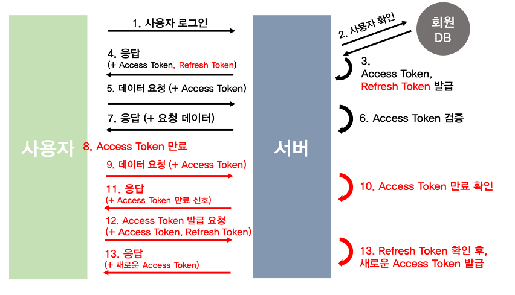

<details>
<summary>Table of Contents</summary>

- [OSI 7 계층](#osi-7-계층)
- [TCP 3-way-handshake & 4-way-handshake](#tcp-3-way-handshake--4-way-handshake)
- [TCP와 UDP의 차이점](#tcp와-udp의-차이점)
- [HTTP와 GET,POST](#http와-getpost)
- [HTTP와 HTTPS](#http와-https)
- [DNS와 DNS Round Robin](#dns--domain-name-system-)
- [웹 통신의 전체적인 흐름](#웹-통신의-전체적인-흐름)
- [Session과 JWT](#session과-jwt)
- [HTTP 상태코드](#http-상태코드)
</details>


## OSI 7 계층


# OSI(Open Systems Interconnection) 7계층

OSI 7계층이란?

- 통신이 일어나는 과정을 7단계로 정의한 국제 통신 표준 규약이다.
- 계급, 상하구조가 존재한다. ex)물리적 회선 연결이 있어야 데이터를 보낼 수 있다.
- 각 계층은 독립되어있다 따라서 용이성, 유지관리가 수월하다.

왜 7계층으로 나눌까?

통신이 일어나는 과정을 단계별로 알 수 있고, 특정한 곳에 이상이 생기면 그 부분만 수정할 수 있기 때문이다.

---

### OSI 7계층 나열

### 1) 물리 계층 (Physical Layer) - 리피터, 케이블, 허브 등

- 데이터를 전기적인 신호로 변환해서 주고받는 기능을 진행하는 공간
- 데이터 단위: 데이터는 0과 1의 비트열, 즉 On,Off 전기적 신호 상태로 이루어진다.
- 데이터를 전달하기만 한다. 에러에 관여X
- 대역폭과 전송효율이 중요

### 2) 데이터 링크 계층 (Data Link Layer) - 브릿지, 스위치

- 물리계층으로 송/수신되는 정보를 확인하고 오류 없는 통신을 위해 여러 역할을 수행한다.
- Mac 주소를 통해 통신한다. 프레임에 Mac 주소를 부여하고 에러 검출, 재전송 흐름 제어를 진행한다.
- 데이터 단위: 프레임(Frame)
- 하드웨어와 소프트웨어 특성을 둘 다 가진다 (물리계층은 하드웨어적 특성을 가지고, 네트워크 계층부터는 소프트웨어적인 특성을 가진다. 연결다리 역할)

※Mac address - 컴퓨터간 데이터를 전송하기 위해 있는 컴퓨터의 물리적 주소 // 맥주소의 다른 이름은 하드웨어 주소 = 기계의 고유 번호

IP는 변할 수 있지만 MAC은 변하지 않는다.

원래 IP주소를 가지고 데이터 주고 받는 게 아니에요?

- 맞다. 컴퓨터와 통신하기 위해서 IP주소를 사용하는 게 맞는데 실제로는 IP주소를 Mac address로 바꿔 사용하기 때문에 IP주소를 사용한다는 것이 결국 맥주소를 사용하는 것과 같다. IP 통신 내부에 맥 주소 통신이 포함되어 있다.

### 3) 네트워크 계층 (Network Layer) - 라우터

- 데이터를 목적지까지 가장 안전하고 빠르게 전달하는 기능(라우팅)을 담당한다.
- 라우터를 통해 이동할 경로를 선택하여 IP주소를 지정하고, 해당 경로에 따라 패킷을 전달해준다.(=패킷을 네트워크 간의 IP를 통하여 데이터를 전달한다)
- 라우팅, 흐름제어, 오류제어, 세그먼테이션 등을 수행한다.
- 데이터 단위: 패킷(Packet)

### 4) 전송 계층 (Transport Layer) -TCP, UDP

- 두 호스트 시스템으로부터 발생하는 데이터의 흐름을 제공한다
- TCP와 UDP 프로토콜을 통해 통신을 활성화한다. Port를 열어두고, 프로그램들이 전송할 수 있도록 제공해준다.
- 데이터 단위: Segment

### 5) 세션 계층 (Session Layer) - API, Socket

- 통신 시스템 사용자 간의 연결을 유지 및 설정한다
- 데이터가 통신하기 위한 논리적 연결을 담당한다. 세션을 만들고 없애는 책임을 지니고 있다.

### 6) 표현 계층(Presentation Layer) - JPEG,MPEG

- 세션 계층 간의 주고받는 인터페이스를 일관성 있게 제공한다.
- 데이터 표현에 대한 독립성을 제공하고, 암호화하는 역할을 담당한다.
- 파일 인코딩, 명령어를 포장, 압축, 암호화한다.

### 7) 응용 계층 (Application) - HTTP, FTP, DNS 등

- 사용자가 네트워크에 접근할 수 있도록 서비스를 제공한다.
- 최종 목적지로, 응용 프로세스와 직접 관계하여 일반적인 응용 서비스를 수행한다.
- 사용자 인터페이스, 전자우편, 데이터베이스 관리 등의 서비스를 제공한다.

---

### 예시

### 미국에 있는 친구에게 편지를 보낸다

- 응용 계층 : 편지를 쓴다.
- 표현 계층 : 한글로 작성한 편지를 미국 친구가 알아볼 수 있게 번역한다.
- 세션 계층 : 미국 친구의 집 주소를 기입한다.
- 전송 계층 : 우체국에 편지를 접수시키기 위한 절차, 즉 배 또는 비행기 등의 운송수단 결정
- 네트워크 계층 : 우체국에 있는 여러 편지들을 같은 목적지 별로 뷴류한다.
- 데이터링크 계층 : 해당되는 목적지와 운송 방법에 따라 분류하며, 해당되는 목적지와 직접 연결이 되지 않는 경우 중간 경유지를 선택하여 분류하는 작업이다.
- 물리 계층 : 실제적으로 편지가 배, 비행기, 자동차 등의 운송수단에 의해서 운송되는 것을 의미한다.

### 이메일 전송을 한다

- 응용 계층 : 이메일 프로그램을 통해 이메일을 작성한다.
- 표현 계층 : 공통된 표현 형식으로 데이터를 변환하거나, 암호화, 압축을 수행한다.
- 세션 계층 : 데이터의 동기화를 위해 일정한 길이마다 sync를 삽입하여 전송 계층으로 데이터를 전달한다.
- 전송 계층 : 발신지와 목적지의 주소를 지정하고, 연결 방식, 흐름제어, 오류제어를 한다. 그리고, 데이터를 전송할 수 있는 세그먼트 단위로 나눈다.
- 네트워크 계층 : 발신지와 목적지의 주소가 아닌 라우팅에 필요한 논리 주소를 설정하고, 패킷에 대한 라우팅 정보를 삽입한다.
- 데이터링크 계층 : 프레임 단위로 데이터를 나눈다. MAC 주소를 지정하고, 각 양 끝단의 속도 차이에 대해 원활하게 해주기 위한 흐름제어를 한다. 또한 데이터의 오류를 막기 위해 CRC방법이나 체크썸 방식을 사용해 데이터를 받는 쪽에서 데이터의 오류를 검사할 수 있도록 설정한다.
- 물리 계층 : 전송 매체가 일반 케이블인지, 광 케이블인지 등의 설정을 한다. 그리고 전송 방식과 데이터를 회선으로 보내기 위한 전기적인 변환을 담당한다.


## TCP 3-way-handshake & 4-way-handshake

### **TCP란?**

TCP는 네트워크 계층 중 전송 계층에서 사용하는 프로토콜 중 하나로, 신뢰성을 보장하는 연결형 서비스이다.

### **TCP 특징**

- 전송되는 데이터의 신뢰성 보장 (흐름 제어, 혼잡 제어, 오류 제어)
- 파일전송에 주로 사용
- 가상 회선을 만들어 신뢰성을 보장

※ TCP가 가상회선 방식을 제공한다는 것은 발신지와 수신지를 연결하여 패킷을 전송하기 위한 논리적 경로를 배정한다는 말이다.

---

### **3-way-handshake**


연결하고자 하는 두 장치 간의 논리적 접속을 성립하기 위해 사용하는 연결 확인 방식으로, 3번의 확인 과정을 거친다고 해서 3 way handshake라고 부른다.

TCP 3-way-handshake를 간단히 표현하면 다음과 같다.

1. Client -> Server : 내 말 들려?
2. Server -> Client : 잘 들려. 내 말은 들려?
3. Client -> Server : 잘 들려!


SYN (synchronize sequence numbers) - 연결 확인을 위해 보내는 무작위의 숫자값 (내 말 잘 들려?)

ACK (acknowledgements) - Client 혹은 Server로부터 받은 SYN에 1을 더해 SYN을 잘 받았다는 ACK (잘 들려)

이를 적용하면

### A 프로세스(client)가 B 프로세스(Server)에 연결을 요청

1. A(CLOSED) -> B(LISTEN) : SYN(a)

- 프로세스 A가 연결 요청 메시지 전송 (SYN)
- 이 때 sequence number를 임의의 랜덤 숫자 a로 지정하고, SYN 플래그 비트를 1로 설정한 segment를 전송한다.

2. B(SYN_RCV) -> A(CLOSED) : ACK(a+1), SYN(b)

- 연결 요청 메시지를 받은 프로세스 B는 요청을 수락(ACK)했으며, 요청한 A 프로세스도 포트를 열어달라(SYN)는 메시지 전송
- 받은 메시지에 대한 수락에 대해서는 ACK number를 SYN number + 1 로 지정하여 표현한다. 그리고 SYN과 ACK 플래그 비트를 1로 설정한 segment를 전송한다.

3. A(ESTABLISHED)  -> B(SYN_RCV): ACK(b+1)

- 마지막으로 프로세스 A가 수락 확인을 보내 연결을 맺음 (ACK)
- 이 떄, 전송할 데이터가 있으면 이 단계에서 데이터를 전송할 수 있다.

```
  ㅇ SYN (Synchronize)  [연결시작,회선개설 용도]
     - TCP 연결설정 초기화를 위한 순서번호의 동기화  ☞ TCP 연결 설정
        . 연결요청  : SYN=1, ACK=0   (SYN 세그먼트)
        . 연결허락  : SYN=1, ACK=1   (SYN+ACK 세그먼트)
        . 연결설정  : ACK=1          (ACK 세그먼트)
```

```
ㅇ ACK (Acknowledgement)
     - 확인응답 필드에 확인응답번호(Acknowledgement Number) 값이 셋팅됐음을 알림
        . 1로 셋팅되면, 확인번호 유효함을 뜻함
        . 0로 셋팅되면, 확인번호 미포함 (즉, 32 비트 크기의 확인응답번호 필드 무시됨)
     - SYN 세그먼트 전송 이후(TCP 연결 시작후) 모든 세그먼트에는 항상 이 비트가 1로 셋팅됨
```

상태                                         설명

| CLOSED | 연결 수립을 시작하기 전의 기본 상태 (연결 없음) |
| --- | --- |
| LISTEN | 포트가 열린 상태로 연결 요청 대기 중 |
| SYN-SENT | SYN 요청을 한 상태 |
| SYN-RECEIVED | SYN 요청을 받고 상대방의 응답을 기다리는 중 |
| ESTABLISHED | 연결의 수립이 완료된 상태, 서로 데이터를 교환할 수 있다. |

즉 이 예시의 최종 PORT 상태 : A-ESTABLISHED, B-ESTABLISHED (연결 수립)


- Client가 연결하고자 하는 Server에게 seq port (2915269997) 전송
- Server가 해당 seq pory를 받고 해당 숫자에 1을 더한 ack port (2915269998) + Client의 연결을 확인하고자 하는 seq port (1458477026) 전송
- Client가 Server의 seq port를 받고 해당 숫자에 1을 더한 ack port (1458477027)을 Server에 전송

---

### TCP 4-way-handshake

3 way handshake와 반대로 가상 회선 연결을 해제할 때 주고 받는 확인작업이다. 이 역시 4번의 확인과정을 거친다고 하여 4 way handshake라고 부른다.

TCP 4 way handshake를 간단히 표현하면 다음과 같다.

- A -> B: 나는 다 보냈어. 이제 끊자!
- B -> A: 알겠어! 잠시만~
- B -> A: 나도 끊을게!
- A -> B: 알겠어!


FIN (Finish) - TCP 연결을 종료하겠다는 메시지

### A 프로세스(client)가 B 프로세스(Server)에 연결 해제를 요청

1. A(ESTABLISHED) -> B(ESTABLISHED) : FIN

- 프로세스 A가 연결을 종료하겠다는 FIN 플래그를 전송
- 프로세스 B가 FIN 플래그로 응답하기 전까지 연결을 계속 유지

2. B(CLOSE_WAIT) -> A(FIN_WAIT_1) : ACK

- 프로세스 B는 일단 확인 메시지(ACK)를 보내고 자신의 통신이 끝날 때까지 기다린다.
- ACK Number를 SYN Number +1로 지정하고, ACK 플래그 비트를 1로 설정한 segment를 전송한다.
- 그리고 자신이 전송할 데이터가 남아있다면 이어서 계속 전송한다. (클라이언트 쪽에서도 아직 서버로부터 받지 못한 데이터가 있을 것을 대비해 일정 시간동안 세션을 남겨놓고 패킷을 기다린다. 이를 TIME_WAIT 상태라고 한다.)

3. B(CLOSE_WAIT) -> A(FIN_WAIT_2) : FIN

- 프로세스 B의 통신이 끝나면 이제 연결 종료해도 괜찮다는 의미로 프로세스 A에게 FIN 플래그를 전송한다.

4. A(TIME_WAIT) -> B(LAST_ACK) : ACK

- 프로세스 A는 FIN 메시지를 확인했다는 메시지를 전송 (ACK)
- 프로세스 A로부터 ACK 메시지를 받은 프로세스 B는 소켓 연결을 해제한다.

**상태                 설명**

| CLOSE | 연결 수립을 시작하기 전의 기본 상태 (연결 없음) |
| --- | --- |
| ESTABLISHED | 연결의 수립이 완료된 상태, 서로 데이터를 교환할 수 있다. |
| CLOSE-WAIT | 상대방의 FIN(종료 요청)을 받은 상태. 상대방 FIN에 대한 ACK를 보내고 애플리케이션에 종료를 알린다. |
| LAST-ACK | CLOSE-WAIT 상태를 처리 후 자신의 FIN요청을 보낸 후 FIN에 대한 ACK를 기다리는 상태. |
| FIN-WAIT-1 | 자신이 보낸 FIN에 대한 ACK를 기다리거나 상대방의 FIN을 기다린다. |
| FIN-WAIT-2 | 자신이 보낸 FIN에 대한 ACK를 받았고 상대방의 FIN을 기다린다. |
| CLOSING | 상대방의 FIN에 ACK를 보냈지만 자신의 FIN에 대한 ACK를 못받은 상태 |
| TIME-WAIT | 모든 FIN에 대한 ACK를 받고 연결 종료가 완료된 상태. 새 연결과 겹치지 않도록 일정 시간 동안 기다린 후 CLOSED로 전이한다. |

즉 이 예시의 최종 PORT 상태 : A-CLOSED, B-CLOSED(연결 해제)

참고:

[https://github.com/Seogeurim/CS-study/tree/main/contents/network](https://github.com/Seogeurim/CS-study/tree/main/contents/network)

[https://seongonion.tistory.com/74](https://seongonion.tistory.com/74)


---
## TCP와 UDP의 차이점

### TCP (Transmission Control Protocol)


TCP segment의 구조

### TCP 특징

**연결형 서비스**

연결형 서비스로 가상회선방식을 사용한다. ex) [3-way-handshaking, 4-way-handshaking](https://woo0doo.tistory.com/6)

자세한 내용은 위에 링크를 클릭해주길 바란다.

**흐름제어 (Flow Control)**

데이터의 처리속도를 제어한다.

이를 제어함으로써, 수신자가 데이터를 받는 데에 있어 오버플로우 발생을 방지한다.

segment 구조에서 receive window가 receiver가 얼만큼의 데이터를 받을 수 있는지에 대한 정보를 나타낸다.

**혼잡제어 (Congestion Control)**

네트워크 내에서의 데이터 양을 제어함으로써 통신의 혼잡/부하가 생기는 것을 방지한다.

**전이중,점대점 방식**

전이중 방식: 양방향으로 전송/수신이 가능한 쌍방향 통신방식

점대점 방식: 통신을 하는 두 객체간 1:1 연결이 되어있는 방식

즉, 멀티캐스팅이나 브로드캐스팅을 지원하지 않는다.

**신뢰성이 높은 전송(Reliable tansmission)**

- Dupack-based retransmission
- 정상적인 상황에서는 ACK 값이 연속적으로 전송되어야 한다.
- 그러나 ACK값이 중복으로 올 경우 패킷 이상을 감지하고 재전송을 요청한다.
- Timeout-based retransmission
- 일정시간동안 ACK 값이 수신을 못할 경우 재전송을 요청한다.
---
### UDP(User Datagram Protocol)


UDP의 구조

### UDP 특징

**비연결형 서비스**

- 비연결(Counnectionless)한 특징을 갖는다. (데이터그램 방식)
- TCP와 달리, 논리적인 경로를 수립할 필요가 없으므로 3-way-handshaking 같은 절차가 존재하지 않는다.

※데이터그램 : 데이터 전송 간에 송/수신자 사이에 가상 회선이라 불리는 논리적 경로를 설정하지 않고, 패킷들이 각기 독립적으로 전송되는 방식이다.

**흐름제어X, 혼잡제어X, 데이터 전송보장X, 순서 보장X**

- TCP에서 제공하는 안정성과 관련된 기능을 제공하지 않는다.
- Checksum을 활용해서 최소한의 오류만을 검출한다.

이러한 이유로, TCP와 달리 빠른 속도와 적은부하를 갖는다.

활용되는 예 -> 실시간 스트리밍, DNS 등

**점대점, 브로드캐스팅, 멀티캐스팅**

TCP와 달리, 점대점 통신뿐만 아니라 1:N 관계 / N:M 관계의 멀티캐스팅 방식 모두 지원한다.

---

### TCP vs UDP

TCP의 데이터 송신 과정


반면 UDP는 쌍방향 의사소통이 아닌 일방적 의사소통이다.

UDP의 데이터 송신 과정


상대방이 데이터를 수신했는지 말았는지 여부는 UDP에서 중요하지 않다.

그저 보냈다는 것이 중요할 뿐이다.

따라서 신뢰성이 요구되는 애플리케이션에서는 TCP를 사용하고, 간단한 데이터를 빠른 속도로 전송하고자 하는 애플리케이션에서는 UDP를 사용한다.

---

### **요약**


---
## HTTP와 GET,POST
### HTTP(Hyper Text Transfer Protocol)

### **HTTP의 개념**

HTTP는 하이퍼텍스트 전송 규약으로, 웹 브라우저(Web Browser) 같은 응용프로그램을 통해 웹 클라이언트(사용자)와 웹 서버(서비스 제공자) 사이 데이터를 전송하는 프로토콜이다.

HTTP를 통해 주고 받는 대표적인 파일은 HTML 문서파일이 있다.

---

### **HTTP의 특징**

- TCP/IP를 이용하는 응용 프로토콜(application protocol)이다.
- 연결 상태를 유지하지 않는 비연결성 프로토콜이다.
- 요청/응답 (Request/Response) 방식으로 동작한다.

연결 상태를 유지하지 않기 때문에 정보를 저장하기 위해 쿠키(Cookie)와 세션(Session)이 등장했다.
<details>
<summary>쿠키와 세션</summary>
쿠키란?

- 웹 서버가 웹 브라우저에게 보내어 저장했다가 서버의 부가적인 요청이 있을 때 다시 서버로 보내주는 문자열 정보
- 웹페이지 방문 시 방문 기록 등 브라우저에서의 정보들이 저장된 텍스트 파일

즉, 쿠키는 서버를 대신해 웹 브라우저에 저장하고 요청을 할 때 그 정보를 서버에 보내 사용자를 식별할 수 있게 한다.

#### 쿠키의 활용


- 1. 세션 관리(Session Management)
     로그인, 사용자 닉네임, 접속 시간, 장바구니 등의 서버가 알아야할 정보들을 클라이언트에서 저장합니다.


- 2. 개인화(Personalization)
     사용자마다 다르게 그 사람에 적절한 페이지를 보여줄 수 있습니다.

개인화의 예시로는 RPG게임을 할때 내 계정으로 보여지는것과
다른사람의 계정으로 들어갔을때 보여지는것이 다른 현상이 있습니다.

- 3. 트래킹(Tracking)
     사용자의 행동과 패턴을 분석하고 기록합니다.


> 트래킹 쿠키란?
>
>앱에서의 활동을 기록하고 성과를 측정하여 인사이트를 얻게 해주는 것입니다.
>
예를들자면 광고주가 인터넷 광고를 할때 그 광고를 보는 사람이 무엇을 보는지 좋아하는지 기록해주는것이 있고
이러한 행위를 막는 툴중에는 광고차단기능으로 유명한 '애드블록'이 있습니다.

---
#### 퍼스트 파티 쿠키와 써드 파티 쿠키

본래 쿠키의 역할을 대체할 수많은 api(FLoC API,토픽 API 등)가 개발됨에 따라
쿠키의 가장 큰 목적은 **디지털 마케팅이** 됐습니다.

이때 주로 쓰이는것이 **퍼스트 파티 쿠키와 써드 파티 쿠키 입니다.**

공통점은

기본적으로 웹사이트에 방문할 시 브라우저 별로 쿠키가 생성되고,
이러한 쿠키는 계속 발행되는 것이 아니라, 자신의 웹사이트에서 발행한 쿠키가 없을 때 생성합니다

이런 특징때문에
웹 분석 시 쿠키의 존재 여부로 재방문을 판단하기도 합니다.

**퍼스트 파티 쿠키의 기능으로는**

- A사이트를 방문할 때 뜨는 팝업에 <다시 보지 않기>를 체크하면 이후에 다시 뜨지 않도록 하게 해주는 기능

- 방문자가 신규인지 재방문인지 판단하는 기능

- 아이디 기억하기, 로그인 상태 유지하기 기능

등 다양합니다.

하지만 치명적인 단점이 있는데, **1개 사이트의 정보만 담고 있다는 것입니다.**

---


물건을 파는 광고주는 사용자가 다른 사이트에 들러도 자신이 파는 물건을 원할만한 사람이라면 자신의 광고를 띄워주기를 바랄 것입니다.

하지만 퍼스트 파티의 경우 웹사이트 마다 쿠키가 하나씩만 고유하게 생기므로

**같은 사용자인지 알 수 없습니다.**

---


써드 파티 쿠키는

스크립트만 설치되어 있으면 여러 개의 사이트에 쿠키를 생성할 수 있고, 반대로 1개의 사이트에는 목적에 따라 여러 개의 쿠키를 생성할 수 있습니다.

또한 아래와 같은 방식으로 **타깃 만들기를** 할 수 있습니다.


예를들어 제주 여행 광고를 클릭하면 쿠키가 생성되고, 이를 통해

제주 여행에 관심이있는 사람이구나 라는것을 알 수 있다.


뿐만아니라

해당 광고 클릭시 생성되는 쿠키가 어디에서 클릭되었는지 확인이 되기에

관심사를 분석할 수 있습니다.


이러한 점들때문에  **디지털 마케팅이** 주 목표가 된 쿠키에서

써드 파티 쿠키의 사용빈도가 높을 수 밖에 없었습니다.

---

#### 크롬의 써드 파티 쿠키 폐지 계획

하지만 써드 파티 쿠키가 개인을 특정할 수 있는 수준까지 발전하면서

개인정보를 침해하는 지경에 이르게 되었고,

많은 곳에서 써드 파티 쿠키를 광고의 주축으로 사용하지만,

크롬에서는 2024년까지 써드 파티 쿠키를 폐지할 것이라 예고했고

이것이 2022년에 큰 이슈가 되었습니다.

이 때문에 써드 파티 쿠키의 대체제로 퍼스트 파티 쿠키가 주목받게 되었고,


퍼스트파티 쿠키로

사용자가 어떤 경로로 왔으며, 이후 어느 경로로 재방문했는지, 무엇을 얼마나 탐색하다가 어느 시점에 구매했는지 등을 담고 있는 위와 같은 데이터를 얻을수 있기에

앞으로는 광고시장에서 이를 주로 이용하게 될 예정입니다.

세션이란?

- 일정 시간동안 같은 사용자(브라우저)로 부터 들어오는 일련의 요구를 하나의 상태로 보고 그 상태를 일정하게 유지시키는 기술
- 여기서 일정 시간이란 방문자가 웹 브라우저를 통해 웹 서버에 접속한 시점으로부터 웹 브라우저를 종료함으로써 연결을 끝내는 시점을 말한다.
- 즉 방문자가 웹 서버에 접속해 있는 상태를 하나의 단위로 보고 세션이라고 칭함

---


#### 세션 필요성에대한 예시

쇼핑을 하기위해 쇼핑몰 홈페이지에 들어가서 쇼핑을 다하고 난뒤에는 홈페이지를 닫게된다.

위의 예시를 보면 알 수 있듯이 우리는 수시로 접속을 시도하고 접속을 끊는 과정을 반복하게 된다.

세션이 서버에 남아있는 클라이언트에 대한 정보라고 했는데,
만약 세션없이 접속을 시도하고 끊는것을 반복하면 어떻게 될까?

처음 들어가는 사이트의 경우 매번 들어가는곳보다 로딩이 느린것을 경험해 봤을것이다.

사실 이것은 처음 들어가는 사이트가 느리게 들어가지는것이 아니라
한번 들어가 봤기에 클라이언트에대한 정보 즉 세션이 서버에 남아서
다음에 연결을 시도할때 빠르게 연결되는 것이다.

만약 세션이 없다면
매번  새롭게 다시 연결해야 하므로 서버에 불필요한 연산작업이 늘어나 매번 처음들어가는 사이트를 들어갈때 처럼 많이 기다려야 할 것이다.


---
#### 세션의 활용


- 1. 클라이언트에서 서버로 **연결 요청**하면 서버는 세션 ID를 발급하고
- 2. 이를 쿠키에 담아 클라이언트에 **연결 응답 정보와 함께 전송**해준다.

- 3. 클라이언트가 다음에 연결을 요청할때 이때 받은 세션 ID가 담긴 쿠키와 함께 데이터를 요청하면

- 4. 서버는 쿠키에 담긴 세션 ID를 확인하고 사용자가 누구인지 확인하고 응답하게 된다.

---

쿠키와 세션의 차이점

- 쿠키의 경우는 방에 저장하는 것을 말한다.

  문자의 정보를 방문자 컴퓨터의 메모리


예를 들자면 ID나 비밀번호를 저장하거나 방문한 사이트를 저장하는데에 사용한다.(인터넷 옵션에서 검색 기록 삭제할 때 임시파일, 열어본 페이지 목록, 쿠키 등 정보 삭제라고 나와있음)

- 세션은 방문자의 요청에 따른 정보를 방문자 메모리에 저장하는 것이 아닌 웹 서버가 세션 아이디 파일을 만들어 하는 것을 말한다.

  서비스가 돌아가고 있는 서버에 저장

</details>


---

### **HTTP의 동작 방식**

클라이언트(웹 브라우저, 모바일 등)가 브라우저를 통해서 어떠한 서비스를 URI를 통해 서버에 요청(Request)하면 서버에서는 해당 요청에 대한 결과를 응답(Response)하는 형태로 동작한다.


---

### **HTTP 요청 메서드**

- **GET**

GET 메서드는 정보를 조회하기 위한 메서드로, 서버에서 어떤 데이터를 가져와서 보여주기 위한 용도의 메서드이다.

"가져오는 것(Select)"

GET 방식은 요청하는 데이터가 HEEP Request Message의 Header 부분의 URL에 담겨서 전송된다. 이는 요청 정보를 URL 상에 넣어야 한다는 뜻이다. 요청 정보를 URL에 넣는 방법은 요청하려는 URL의 끝에 **'?'** 를 붙이고, (key=value) 형태로 요청 정보를 담으면 된다. 요청 정보가 여러 개일 때는 **'&'** 로 구분한다.

ex)

```bash
www.urladdress.xyz?name1=value1&name2=value2, www.google.com/search?q=WooYoungDoo
```

GET 방식은 게시판의 게시글 조회 기능처럼 데이터를 조회할 때 쓰이며 서버의 상태를 바꾸지 않는다. 예외적으로 방문자의 로그 남기기 기능이나 글을 읽은 횟수 증가 기능에도 쓰인다.

**GET 방식의 특징**

- GET 메서드에는 바디를 쓰는 것을 지양한다.

실사용 시에는 GET메서드에 바디를 허용하는 경우도 있지만, 많은 서버에서 GET메서드를 처리할 때는 바디를 읽지 않고 시작라인과 헤더를 읽은 후 데이터를 처리한다.

따라서 GET 메서드 사용 시 바디는 쓰지 않는다.

- 요청 데이터가 그대로 url에 노출되므로 사용자가 쉽게 눈으로 확인할 수 있어 POST 방식보다 보안상 취약하다. 보안이 필요한 데이터는 GET 방식이 적절하지 않다.
- GET 방식은 멱등성(연산을 여러 번 적용하더라도 결과가 달라지지 않는 성질)이 적용된다.
- GET 방식은 캐싱을 사용할 수 있어, GET 요청과 그에 대한 응답이 브라우저에 의해 캐쉬된다. 따라서 POST 방식보다 빠르다

※GET의 캐싱 : 서버에 리소스를 요청할 때 웹 캐시가 요청을 가로채 서버로부터 리소스를 다시 다운로드하는 대신 리소스의 복사본을 반환한다.

**GET 요청 예제**

```bash
GET /home.html HTTP/1.1
User-Agent: Mozilla/4.0 (compatible; MSIE5.01; Windows NT)
Host: www.java67.blogspot.com
Accept-Language: en-us
Accept-Encoding: gzip, deflate
Connection: Keep-Alive
```

- **POST**

POST 메서드는 서버의 값이나 상태를 바꾸기 위한 용도의 메서드이다.

"수행하는 것(Insert, Update, Delete)"

POST 방식은 요청하는 데이터가 HEEP Request Message의 Body 부분에 담겨서 전송된다. Request Header의 Content-Type에 해당 데이터 타입이 표현되며, 전송하고자 하는 데이터 타입을 적어주어야 한다.

POST 방식은 게시판 글쓰기 기능처럼 서버의 데이터를 업데이트할 때 쓰인다.

POST 방식의 특징

- Body 안에 데이터를 담아 전송하기 때문에 대용량의 데이터를 전송하기에 적합하다.
- GET 방식보다 보안상 안전하지만, 암호화를 하지 않는 이상 보안에 취약한 것은 똑같다.
- 클라이언트 쪽에서 데이터를 인코딩하여 서버로 전송하고, 이를 받은 서버 쪽이 해당 데이터를 디코딩한다.

**POST 요청 예제**

```bash
POST / HTTP/1.1
content-type:application/x-www-form-urlencoded;charset=utf-8
host: https://importexport.amazonaws.com
content-length:207

Action=GetStatus&SignatureMethod=HmacSHA256&JobId=JOBID&SignatureVersion=2
&Version=2010-06-03&Signature=%2FVfkltRBOoSUi1sWxRzN8rw%3D
&Timestamp=2011-06-20T22%3A30%3A59.556Z
```

**GET VS** **POST**

- 사용목적: GET은 서버의 리소스에서 데이터를 요청할 때, POST는 서버의 리소스를 새로 생성하거나 업데이트할 때 사용한다.
- 요청에 Body 유무 : GET 은 URL 파라미터에 요청하는 데이터를 담아 보내기 때문에 HTTP 메시지에 Body가 없다. POST는 Body에 데이터를 담아 보내기 때문에 당연히 HTTP 메시지에 Body가 존재한다.
- 멱등성 : GET 요청은 멱등이며, POST는 멱등이 아니다.


이외의 HTTP Method에는

PUT - 전체 수정 ex) 회원정보 전체 수정

DELETE - 삭제 ex) 회원정보 삭제

PATCH - 일부 수정 ex) 회원정보 일부 수정 (Update에 가장 가깝게 쓰이고 있다)

OPTIONS - 시스템에서 지원하는 메소드 확인

등이 있다.

출처

[https://www.java67.com/2014/08/difference-between-post-and-get-request.html](https://www.java67.com/2014/08/difference-between-post-and-get-request.html)

[https://github.com/Seogeurim/CS-study/tree/main/contents/network#http-%EC%9A%94%EC%B2%AD-%EB%B0%A9%EC%8B%9D---get-post](https://github.com/Seogeurim/CS-study/tree/main/contents/network#http-%EC%9A%94%EC%B2%AD-%EB%B0%A9%EC%8B%9D---get-post)

[https://88240.tistory.com/190](https://88240.tistory.com/190)

---
## HTTP와 HTTPS

### **HTTP (Hypertext Transfer Protocol)**

HTTP는 서로 다른 시스템들 사이에서 통신을 주고받게 해주는 가장 기초적인 프로토콜이다. 웹 서핑을 할 때 서버에서 자신의 브라우저로 데이터를 전송해 주는 용도로 가장 많이 사용된다. 인터넷 초기에 모든 웹 사이트에서 기본적으로 사용된 프로토콜이다.

자세한 HTTP의 동작 방식은 이전 글을 참고해 주길 바란다.

하지만 HTTP에는 단점이 존재했다.

- 평문 텍스트, 즉 암호화되지 않은 텍스트를 전송하는 프로토콜로, 중간자 공격에 취약하다.
- 변조, 위장, 도청에 취약하다.

이 말은 즉슨 데이터가 쉽게 도난 당할 수 있다는 것이다.

이 문제를 해결하기 위해 HTTPS가 등장했다.

---


### **HTTPS (Hypertext Transfer Protocol Secure)**


HTTPS = HyperText Transfer Protocol over Secure Socket Layer = HTTP over SSL = HTTP over TLS

HTTP의 단점인 보안성을 보완한 프로토콜이다.

HTTPS 프로토콜은 SSL(보안 소켓 계층)을 사용함으로써 이 문제를 해결했다.

### **SSL(Secure Socket Layer) 이란?**

SSL은 웹사이트와 브라우저 사이(또는 두 서버 사이)에 전송되는 데이터를 암호화하여 인터넷 연결을 보호하기 위한 표준 기술이다. 이 기술은 해커가 개인 데이터나 금융 데이터 등의 전송되는 정보를 보거나 훔치는 것을 방지한다.

SSL은 공개키 암호화를 기반으로 동작하는 프로토콜이다.

### **암호화 방식**

암호학에서 사용되는 키는 크게 대칭키와 공개키로 구분할 수 있다.

대칭키: 암호화 / 복호화에 사용되는 키가 동일한 방식. A와 B가 암호 통신을 하려 한다면 A와 B는 공통된 대칭키를 가지고 있어야 한다.

공캐키: 대칭키와 다르게 키를 공개키와 비밀키 두 가지로 나눈 방식. 여기서 공개키는 말 그대로 공개된 키로 다른 사용자들에게 공개된다. 하지만 비밀키는 오직 비밀키의 소유자만이 알고 있는 키이다. 공개키로 암호화된 평문은 비밀키로 복호화가 가능하고, 비밀키로 암호화된 평문은 공개키로 복호화가 가능하다.

### 예시

A와 B가 암호화 통신을 한다고 예를 들자.

A는 B의 공개키를 알고 있고, B는 A의 공개키를 알고 있다.

**A -----> B : B의 공개키로 암호화 (공개키 암호화)**

- A가 B의 공개키를 알고 있기 때문에 B의 공개키로 암호화하면 B는 자신의 비밀키로 복호화 할 수 있다.

**A -----> 해커 : B의 공개키로 암호화**

- A가 B의 공개키로 암호화했으므로 B의 비밀키를 모르는 C는 복호화를 할 수 없다.

**A -----> B : A의 비밀키로 암호화 (비밀키 암호화)**

- A가 자신의 비밀키로 암호화한다면 B는 A의 공개키로 복호화 할 수 있다.

**A -----> 해커 : A의 비밀키로 암호화**

- A가 자신의 비밀키로 암호화한다면

  해커 또한 A의 공개키로 복호화 할 수 있다.


비밀키로 암호화 하는 것은 해당 암호문은 A에 의해 생성된 것이라는 일종의 인증 기능을 가진다


---

### 

### **SSL의 기능**

- 통신 내용이 공격자에게 노출되는 것을 막을 수 있다.
- 클라이언트가 접속하려는 서버가 신뢰할 수 있는 서버인지 판단할 수 있다.
- 통신 내용의 악의적인 변경을 방지할 수 있다.

SSL은 이를 위해 **인증서**를 사용한다.

인증서는 신뢰할 수 있는 공인된 기관에서 발급해준다. 이러한 기관을 CA ( Certificate Authority ) 라고 한다

CA에게서 인증서를 발급받은 서버는 클라이언트 입장에서 믿고 사용할 수 있다.

SSL은 이러한 인증서를 통해 클라이언트와 서버가 보안적으로 안전한 상태로 통신하게 돕는다.

---

### **인증서와 SSL의 동작 과정**

인증서에는 아래와 같은 내용이 담겨있다.

- 서비스 서버의 정보 (인증서를 발급한 CA, 서비스 서버의 도메인)
- 서비스 서버 측 공개 키(공개 키 값, 공개 키 암호화 방법)

브라우저는 CA의 리스트와 그 공개 키들을 가지고 있다.

**SSL 동작과정**

**1. Client -> Server 연결을 시도한다 (Client Hello) - handshake**

클라이언트에서 통신하고 싶은 서버로 연결을 시도하는 패킷을 전송한다.

이때, 전송하는 패킷에는 아래의 내용들이 들어있다.

- 자신(client)이 사용 가능한 [cipher suite](https://en.wikipedia.org/wiki/Cipher_suite) 목록 (cipher suite 예시 : TLS_ECDHE_RSA_WITH_AES_128_CBC_SHA)
- session id
- SSL protocol version
- 등등


**2. Server -> client 응답 (Server Hello)**

1번에서 클라이언트에서 받은 인사(Client Hello 패킷)에 대해 서버가 응답을 한다. 이 역시 패킷을 찍어보면 Server Hello라고 나오는 것을 확인할 수 있다.

이때, 서버에서 전송하는 내용은 다음과 같다

- 클라이언트에서 받은 cipher suite 목록 중 선택한 1개의 cipher suite
- SSL protocol version
- 등등


**3. Server -> Client (Certificate, Server Key Exchange, Server Hello Done)**

서버는 2번 패킷 외에 클라이언트에 Certificate 라는 내용의 패킷을 보낸다.

이 Certificate라는 패킷에는 Server의 SSL 인증서 내용이 들어있다. 아래의 패킷 내부를 보면, 인증서의 signature algorithm, public key info 등을 확인할 수 있다.


Certificate 패킷을 전달할 때, Server Key Exchange가 있는데, 이것은 위에서 전달한 Certificate 내의 SSL 인증서에 서버의 공개키가 없을 경우, 서버가 직접 전달함을 의미한다. 즉, 인증서 내부에 내부에 서버의 공개키가 존재한다면 Server Key Exchange는 생략된다.

그리고 server가 행동을 마쳤다는 의미로 Server Hello Done까지 보낸다.

**4. Client 에서 Server의 SSL 인증서 검증**

3번에서 전달받은 서버의 SSL 인증서를 검증한다. 검증 원리는 아래와 같다.

SSL 인증서를 발급한 CA(인증기관)는 CA의 비밀키(private key)를 이용해 인증서를 암호화했다. 그래서 SSL 인증서는 CA의 공개키를 이용해서만 복호화 할 수 있다. 클라이언트는 해당 CA의 공개키를 통해 암호화된 인증서를 복호화 한다. 즉, 클라이언트에서 CA 의 공개키를 이용해 인증서를 복호화했을 때, 복호화가 되었다는 것은 인증서는 해당 CA 에서 발급되었다라는 것을 검증할 수 있는 것.

클라이언트는 CA의 공개키를 어디서 구하는가?

클라이언트가 브라우저 또는 안드로이드 기기일 경우에는, 인증서를 발급하는 주요 인증기관(CA)의 리스트와 공개키를 가지고 있다. 그래서 매번 CA로 요청하는 것이 아닌 가지고 있는 리스트에서 확인할 수 있다.

그러나, 리스트에 없다면 외부 인터넷을 통해 인증기관의 정보와 공개키를 확보한다.


클라이언트는 CA의 공개키를 어디서 구하는가?

클라이언트가 브라우저 또는 안드로이드 기기일 경우에는, 인증서를 발급하는 주요 인증기관(CA)의 리스트와 공개키를 가지고 있다. 그래서 매번 CA로 요청하는 것이 아닌 가지고 있는 리스트에서 확인할 수 있다.

그러나, 리스트에 없다면 외부 인터넷을 통해 인증기관의 정보와 공개키를 확보한다.

**5. Client -> Server 대칭키(비밀키) 전달 (Client Key Exchange, change Ciper Spec)**

이제 클라이언트는 서버와 원하는 데이터를 안전하게 주고받기 위해서는 전달하는 데이터를 암호화해야한다. 클라이언트는 데이터를 암호화하기 위한 대칭키(비밀키, 데이터를 암호화하는 키)를 생성한다.

클라이언트는 이 대칭키(비밀키)를 서버만 볼 수 있게 하기 위해, 서버의 공개키로 암호화를 해서 서버한테 전달한다. (Client Key Exchange) 서버의 공개키는 4번에서 SSL 인증서를 복호화해서 얻었다. 또는 인증서 내부에 없었을 경우 3번에서 서버로부터 직접 전달을 받았다(Server Key Exchange)

이제 클라이언트는 Change Cipher Spec을 통해 SSL Handshake의 완료를 알린다.


**6. Server / Client SSL Handshake Finished**

서버는 클라이언트가 5번에서 전달한 암호화된 대칭키(비밀키)를 받았다. 이키는 서버의 공개키로 암호화 되었으니 서버의 비밀키로 복호화해서 얻을 수 있다.

이제 서버/클라이언트 모두 동일한 대칭키(비밀키)를 갖고 있으니 보안을 가진 통신을 할 수 있다.

---

### **인증서확인법**


좌물쇠를 클릭하게 되면 다음과 같이 나오게된다.


이렇게 인증서에 키가 담겨있는 것을 확인할 수 있다.

참고

[https://nukw0n-dev.tistory.com/11?category=940859](https://nukw0n-dev.tistory.com/11?category=940859)

[https://nuritech.tistory.com/25](https://nuritech.tistory.com/25)

https://m.blog.naver.com/PostView.naver?isHttpsRedirect=true&blogId=skinfosec2000&logNo=222135874222

---

## DNS(Domain Name System)

- DNS는 호스트의 도메인 이름을 호스트의 네트워크 주소로 바꾸거나 그 반대의 변환을 수행할 수 있도록 하기 위해 개발되었다.
- 특정 컴퓨터(또는 네트워크로 연결된 임의의 장치)의 주소를 찾기 위해, 사람이 이해하기 쉬운 도메인 이름을 숫자로 된 식별 번호(IP 주소)로 변환해 준다. 도메인 네임 시스템은 흔히 "전화번호부"에 비유된다.
- 인터넷 도메인 주소 체계로서 TCP/IP의 응용에서, www.google.com 이라는 도메인 이름을 DNS 서버에게 제공하면, 24.55.67.22 라는 IP 주소로 변환하고 라우팅 정보를 제공하는 분산형 데이터베이스 시스템이다.


---

**DNS 과정**

1. DNS Query

- DNS 서버에서 도메인 이름에 해당하는 IP 주소를 요청하여 받아온다.
- 이때, DNS 서버에 접속하는 사용자에 대해 Round Robin을 이용해 IP를 할당하게 된다.

2. IP communication

- IP 주소를 받아오면 사용자는 리퀘스트 메시지를 보내 네트워크 통신을 시작한다.

---

### **DNS Round Robin**

- DNS를 이용하여 부하 분산을 이용한다.
- DNS 서버에서 하나의 도메인 명에 여러 개의 IP 주소를 등록시켜두고 클라이언트로부터 요청이 있으면 등록되어 있는 IP 주소를 순서대로 반환하는 방식이다
- 반환되는 IP 주소가 바뀌므로 클라이언트의 행선지도 바뀌어 결과적으로 커넥션이 분배된다.


시분할 시스템을 위해 설계된 선점형 스케쥴링의 하나로서, 프로세스들 사이에 우선순위를 두지 않고, 순서대로 시간단위로 CPU를 할당하는 방식의 CPU 스케쥴링 알고리즘이다.

각 프로세스에 일정시간을 할당하고, 할당된 시간이 지나면 그 프로세스는 잠시 보류한 뒤 다른 프로세스에게 기회를 주고, 또 그 다음 프로세스에게 하는 식으로, 돌아가며 기회를 부여하는 운영방식이라 풀어 말할 수 있다.

즉 DNS 서버에 대한 Round Robin 형식으로 구성할 경우 로드밸런서가 필요가 없다. 이 말은 즉슨 부하에 대한 걱정을 할 필요가 없다는 것이다.(자동으로 시간에 따라서 스케쥴링이 변환되기 때문에)

※로드밸런서 - 서버에 가해지는 트래픽을 여러대의 서버에게 균등하게 분산시켜주는 역할을 함


---

### **Round Robin의 문제점**

1. 서버의 수 만큼 공인 IP 주소가 필요

2. 균등하게 분산되지 않다.

- 스마트폰 접속의 경우, 프록시 서버를 경유하는데, 프록시 서버에서는 변환 결과가 일정시간 동안 캐싱된다. 같은 프록시 서버를 경유하는 접속은 항상 같은 서버로 접속

3. 서버가 다운돼도 확인이 불가하다.

- DNS 서버는 웹 서버의 부하나 접속 수 등의 상황에 따라 질의결과를 제어할 수 없음
- 전혀 감지가 안되기 때문에 어떤 원인으로 다운되어도 검출하지 못하고 유저에게 제공

DNS 라운드 로빈은 부하분산을 위한 방법일 뿐, 다중화 방법이 아니므로 다른 S/W와 조합해서 관리해야 한다.

---

### **이를 극복하기 위한 방법**

- **Weighted round robin (WRR)**

각각의 웹 서버에 가중치를 가미해서 분산 비율을 변경

=> 가중치가 큰 서버일수록 빈번하게 선택되므로 처리능력이 높은 서버를 가중치가 높게 설정한다.

또 다른 방법으로는 로드 밸런서의 도입을 통해 다음과 같은 구성도 가능하다.

- **Least connection**

접속 클라이언트 수가 가장 적은 서버를 선택

=> 로드밸런서에서 실시간으로 connection 수를 관리하거나 각 서버에서 주기적으로 알려주는 것이 필요.

---

출처

[https://velog.io/@eu_nzi/%EB%84%A4%ED%8A%B8%EC%9B%8C%ED%81%AC-DNS-round-robin%EC%9D%98-%EB%B0%A9%EC%8B%9D](https://velog.io/@eu_nzi/%EB%84%A4%ED%8A%B8%EC%9B%8C%ED%81%AC-DNS-round-robin%EC%9D%98-%EB%B0%A9%EC%8B%9D)

[https://github.com/Seogeurim/CS-study/blob/main/contents/network/materials/yoongoing_networkflow.pdf](https://github.com/Seogeurim/CS-study/blob/main/contents/network/materials/yoongoing_networkflow.pdf)

---
## 웹 통신의 전체적인 흐름

### **웹이란?**

WWW (world wide web)의 약자이며 인터넷으로 연결된 컴퓨터를 통해 정보를 공유할 수 있는 공간을 뜻한다.

흔히 인터넷과 통용하여 사용하는데 엄연히 다른 개념이다.

- 인터넷 : 인터넷 프로토콜을 사용해 네트워크와 기기 간 통신하는 컴퓨터 네트워크들이 전세계적으로 상호 연결되어 이루는 시스템이다.
- 인터넷 vs 웹:


비유를 한 예:

- 인터넷이 도시라면, 웹은 도시 위에 있는 건물 하나
- 인터넷이 도로라면, 웹은 도로 위에 있는 자동차 한대

기본적으로 웹 통신은 HTTP 프로토콜을 사용하여 통신한다.


- 웹에 연결된 컴퓨터는 **클라이언트(Client)**와 **서버(Server)**로 구분한다.
- 클라이언트 : 사용자가 서버에 접속하기 위해 사용하는 프로그램 또는 서비스이다. ex) 웹 브라우저, 모바일 앱 등
- 서버 : 클라이언트에게 네트워크를 통해 정보나 서비스를 제공하는 컴퓨터 시스템

이러한 클라이언트와 서버가 **Request**와 **Response**를 주고 받으며 통신이 일어난다.

---


### **웹 통신의 과정**

[https://www.google.com/](https://www.google.com/) 주소창에 해당 URL을 입력한 뒤 클라이언트에 화면이 렌더링 되기까지의 과정은 어떨까?

그 전에, IP주소와 도메인 이름 그리고, 이 둘의 관계에 대해 알아보겠다.

- IP주소 : 컴퓨터들의 고유 식별번호로 생각하면 된다. IP주소는 129.0.0.1과 같은 형태의 숫자로 나타난다.

※ 현재는 .(점)으로 구분된 각 자리에서 0~255를 나타낼 수 있는 32비트의 IPv4 프로토콜을 사용하나, 인터넷 사용자 수의 증가로 IP주소 부족 현상이 일어났고, 이는 128비트의 IPv6가 등장하는 배경이 되었다.

- 도메인 이름 : 사람이 쉽게 외울 수 있도록 IP주소를 문자로 표현한 것이다. 예를들면 google.com이 도메인 이름에 해당한다.

터미널을 켠뒤 nslookup google.com 을 입력해보면, google.com 도메인이 갖는 IP주소를 알 수 있고, 주소창에 해당 IP주소를 입력하면 도메인을 입력했을 때와 같은 결과를 얻는다.


※ 실제로는 IP로 나오지 않고 google.com이라는 똑같은 값을 가짐. 이해를 돕기위해 URL창에 IP를 써놓음

즉, 브라우저에 입력된 도메인 이름을 통해 해당 도메인의 IP주소를 얻은 뒤 통신을 시작할 수 있다는 것이다.

도메인 이름 -> IP 과정에서 필요한 도우미 역할을 하는 것이 DNS 이다.

전체적인 흐름을 보면,


1. 사용자가 웹 브라우저를 통해 **URL**을 입력한다.

2. 입력된 URL 중 도메인 네임을 **DNS** 서버에서 검색한다.

3. DNS 서버에서 해당 도메인 네임에 해당하는 **IP 주소**를 찾아 사용자가 입력한 URL 정보와 함께 전달한다.

4. 웹 페이지 URL 정보와 전달받은 IP 주소를 이용해 **HTTP 요청(= HTTP Request)** 메시지를 생성한다.

5. 요청은 **TCP**를 통해 **서버**로 전송된다.

6. 서버는 클라이언트의 요청을 받고 **응답(= HTTP Response)**을 전송한다.

---

참고:

[https://github.com/Seogeurim/CS-study/tree/main/contents/network#%EC%9B%B9-%ED%86%B5%EC%8B%A0%EC%9D%98-%ED%9D%90%EB%A6%84](https://github.com/Seogeurim/CS-study/tree/main/contents/network#%EC%9B%B9-%ED%86%B5%EC%8B%A0%EC%9D%98-%ED%9D%90%EB%A6%84)

[https://velog.io/@sangmin7648/%EC%9B%B9-%ED%86%B5%EC%8B%A0%EC%9D%98-%ED%81%B0-%ED%9D%90%EB%A6%84](https://velog.io/@sangmin7648/%EC%9B%B9-%ED%86%B5%EC%8B%A0%EC%9D%98-%ED%81%B0-%ED%9D%90%EB%A6%84)

[https://opentutorials.org/module/3097/18040](https://opentutorials.org/module/3097/18040)   

## Session과 JWT
## Stateful, Stateless
Session과 JWT에 대해 알아보기 전에 먼저 `Stateful`과 `Stateless`의 차이를 알아야한다.    
**가볍게** ... 알아보자! 

> * **Stateful(상태 유지)**   
> 서버가 클라이언트의 상태를 보존하는 것.
>   
> 
> * **Stateless(상태 유지)**   
> 서버가 클라이언트의 상태를 보존하지 않는 것   

상태를 보존하냐 안하냐의 차이인데 ... 쉽게 감이 잡히지 않는다. 예를 들어 설명해보겠다.   

먼저 Stateful 예시이다.   

> **클라이언트 A** : 컴퓨터 하나 살게요    
> **서버 X** : 컴퓨터 커스텀 재료를 골라주세용 *(컴퓨터를 사려하는 것을 기억한다)*   
> 
> **클라이언트 A** : 22년 맥북 프로 M2 램 16GB로 주세요   
> **서버 X** : 배송은 어디로 해드릴까요~? *(컴퓨터를 사려하는 것, 커스텀 재료를 기억한다)*    
> 
> **클라이언트 A** : 서울 강남구 OOO으로 보내주세요   
> **서버 X** : 결제는 무엇으로 해드릴까요? *(컴퓨터를 사려하는 것, 커스텀 재료, 배송지를 기억한다)*
> 
> **클라이언트 A** : 삼성 페이로 하겠습니다  
> **서버 X** : 결제 완료. *(클라이언트 A의 모든 요구사항을 기억한다.)*   

위 예시에서는 클라이언트 A와 서버 X만 서로 통신을 했지만 ... 만약 서버 X가 멈추거나 다른 이유로 서버 X를 사용할 수 없게되어 다른 서버를 사용해야한다면 ... ?

> **클라이언트 A** : 컴퓨터 하나 살게요    
> **서버 X** : 컴퓨터 커스텀 재료를 골라주세용 *(컴퓨터를 사려하는 것을 기억한다)*
>
> **클라이언트 A** : 22년 맥북 프로 M2 램 16GB로 주세요   
> **서버 X** : 배송은 어디로 해드릴까요~? *(컴퓨터를 사려하는 것, 커스텀 재료를 기억한다)*
>
> ***서버 X ... DIE***
> 
> **클라이언트 A** : 서울 강남구 OOO으로 보내주세요   
> **서버 Y** : 네? 뭐를 보내달라는거죠?
>
> **클라이언트 A** : 삼성 페이로 하겠습니다  
> **서버 Z** : ?????

Stateful의 경우 서버가 중간에 바뀐 경우, 요청을 처음부터 다시 해야한다는 단점이 있다. 


다음은 Stateless 예시이다.

> **클라이언트 A** : 컴퓨터 하나 살게요    
> **서버 X** : 컴퓨터 커스텀 재료를 골라주세용 *(서버는 아무것도 기억하지 않는다.)*
>
> **클라이언트 A** : 컴퓨터 하나 살게요. 22년 맥북 프로 M2 램 16GB로 주세요.   
> **서버 Y** : 배송은 어디로 해드릴까요~? *(컴퓨터를 사려하는 것, 커스텀 재료를 기억한다)*
>
> **클라이언트 A** : 컴퓨터 하나 살게요. 22년 맥북 프로 M2 램 16GB로 주세요. 서울 강남구 OOO으로 보내주세요   
> **서버 Z** : 결제는 무엇으로 해드릴까요? *(컴퓨터를 사려하는 것, 커스텀 재료, 배송지를 기억한다)*
>
> **클라이언트 A** : 컴퓨터 하나 살게요. 22년 맥북 프로 M2 램 16GB로 주세요. 서울 강남구 OOO으로 보내주세요. 삼성 페이로 하겠습니다  
> **서버 Y** : 결제 완료. *(서버는 요청을 처리한다.)* 

Stateless의 단점은 클라이언트에서 보내야할 내용이 많아진다.   
Stateless를 사용하게 되면, 서버는 단순히 받아서 응답만 해주기 때문에 서버에 대한 부하가 적다. 또한 우리가 주로 사용하는 HTTP는 Stateless한 성격을 가진 프로토콜이다.
    

## 인증(Authentication)과 인가(Authorization)의 차이
음음 ... Stateful과 Stateless의 차이점을 알았으니 이제 JWT에 대해 공부할 수 있는건가요?

딱 하나만 더 알아보자! 바로 인증과 인가의 차이가 뭘까?
Session과 JWT에 대해 알아보기 전에 먼저 `인증(Authentication; 이하 Authe)`과 `인가(Authorization; 이하 Authz)`의 차이를 알아야한다.   

> * **인증**   
> 사용자가 누구인지 확인하는 절차 ex) 로그인
>    
> * **인가**   
> 사용자가 요청하는 요청(Request)을 실행할 수 있는 권한 여부를 확인하는 절차

위에서 알아본 `Stateless`와 `인증(Authe)` & `인가(Authz)`가 어떤 연관이 있을까?   

(구글/애플 스토어 누적 다운로드 수 2000회 돌파) SUWIKI 서비스 이용과정을 예로 들어보겠다.   

> **수위키 사용자 A** : 저 로그인 할게요 id는 koownij이고 pw는 1234에요!   
> **수위키 서버** : 로그인 성공했어요! *(서버는 아무것도 기억하지 않는다.)*
>
> **수위키 사용자 A** : 강의평가 작성할게요. 강의명은 알고리즘 분석, 평점은 전부 5점 주겠습니다!    
> **수위키 서버** : 로그인된 유저만 강의평가를 작성할 수 있어요! *(서버는 A가 로그인 했다는 사실을 기억하지 못한다.)*
> 
> **수위키 사용자 A** : ... (하 개귀찮네) 로그인 할게요 id는 koownij이고 pw는 1234, 강의평가 작성할게요. 강의명은 알고리즘 분석, 평점은 전부 5점 이요 ...    
> **수위키 서버** : 강의평가 작성이 완료되었습니다.   
> 
> ***강의평가를 작성할 때마다 클라이언트 A는 매번 로그인 정보를 보내줘야한다. WHY ??? Stateless니까!***   

어 잠시만요 ... 그냥 사용자가 매번 id, pw를 입력하지 않고 id, pw를 내장 DB(웹 브라우저에서는 보통 쿠키를 사용)에 저장해놓고 바로 쓰면 안되나요?   
-> 절.대. 안된다. id, pw를 내장 DB(쿠키) 저장하게 되면 보안상 아주 아주 위험하다. 한번 털리면 바로 끝이난다. 또한 id, pw가 털리게 되면 Suwiki만 털리는 것이 아니라 다른 사이트에도 해당 유저의 정보로 접근할 수 있는 가능성이 있다. (대부분의 유저는 id, pw를 동일하게 사용함)   

따라서 사용자 A의 id, pw를 내장 DB에 저장하는 것이 아닌, 사용자 A의 **권한**을 내장 DB에 저장하고, 서버와 통신할 때마다 해당 **권한**을 넘겨준다. 서버에서는 권한을 토대로 `인가(Authz)`한다.   

권한도 id, pw랑 마찬가지로 털리면 끝 아닌가요 ??? ***응 아니다.*** 보통 권한의 경우 JWT를 사용하는데, JWT의 경우 만료 기간이 있다. 따라서 JWT는 탈취당하더라도 만료 기간이 지나면 권한이 사라진다. (만료 기간을 길게 주지 않는다.) 또한 수위키 JWT는 수위키에서만 사용가능하다. 다른 사이트에서는 사용할 수 없는 정보다.   

## Session과 JWT
음 ... 근데 JWT 말고 Session으로 로그인 유지를 하는 방법이 있다던데요? 무슨 차이죠??

### Session
> 인증을 위한 별개의 정보를 세션 저장소에 저장하고, 클라이언트는 이 정보를 쿠키에 담아서 요청한다. 서버는 세션 저장소에 위치한 정보랑 일치하는지 확인한다.   

1. 클라이언트가 ID/PW로 서버에 로그인 요청
2. ID/PW로 인증 후, 사용자를 식별할 유니크한 세션 ID를 만들어 서버의 세션 저장소에 저장
3. 세션 ID를 클라이언트에 보내준다.
4. 클라이언트에서 사용자 인증이 필요할 때마다 해당 세션 ID를 서버로 보내준다.
5. 서버는 클라이언트에서 보낸 세션 ID와 서버 세션 저정소에 있는 세션 ID를 비교한다.

### 단점
* 세션 ID, Cookie 등이 탈취된다면 세션 저장소를 전부 지워 해결 가능하지만, 탈취당하지 않은 정상적인 사용자도 모두 재인증을 해야하는 상황이 발생한다.   

* 무엇보다 http의 가장 큰 특성중 하나인 stateless를 위배한다는 것이다. stateless라면 서버는 클라이언트의 상태를 저장하지 않아야 하지만 세션 저장소라는 곳에서 클라이언트의 상태를 저장하게 되므로 stateful하게 된다.

* 이게 뭐가문제야? 라고 생각할 수 있지만 만약 서버를 스케일 아웃 해야 한다면? 1번 서버에 로그인한 사용자가 다른 2번 서버로 요청을 보내게 된다면, 2번 서버에는 로그인 상태가 남아있지 않기 때문에 다시 로그인해야 하는 상황이 발생한다.   

**세션 클러스터링**, **스티키 세션**, **JWT**를 통해 해결할 수 있다.   

### JWT
> JSON Web Token (JWT)은 웹표준 (RFC 7519) 으로서 두 개체에서 JSON 객체를 사용하여 가볍고 자가수용적인 (self-contained) 방식으로 정보를 안전성 있게 전달한다.   
> 자가 수용적이라는 의미는 JWT 안에 인증에 필요한 모든 정보를 자체적으로 지니고 있다는 의미이다.   


### JWT 구조
JWT는 `.`을 구분자로 나누어지는 세 가지 문자열의 조합니다.   
`.`을 기준으로 좌측부터 `Header`, `Payload`, `Signature`를 의미한다.   

- **Header**   
  - 헤더는 2가지 정보를 가진다.   
    1. typ - 토큰의 타입(JWT)
    2. alg - 해싱 알고리즘 (Signature를 해싱하기 위한 알고리즘 지정)   

- **Payload**
  - 토근에 담을 정보들이 존재하고 여기에 담는 정보의 한 조각을 클레임(claim)이라고 한다.
  - 클레임은 키값 형태로 존재
    - 클레임의 종류는 등록된(registered) 클레임 , 공개(public) 클레임 , 비공개 클레임 들이 있다.
    - 각 클레임에 대한 설명은 길어져 적지 않았다. 아래 Ref를 참고하자.
  - 페이로드 ex)
  ```{
        "iss": "jh.com", // 등록된 클레임
        "exp": "1485270000000", // 등록된 클레임
        "<https://xxx.com/jwt_claims/is_admin>": true, // 공개 클레임
        "userId": "11028373727102", // 비공개 클레임
        "username": "jh" // 비공개 클레임
    }
  ```

- **서멍(Signature)**
  - 서멍의 구조는 (헤더 + 페이로드)와 서버가 갖고 있는 유일한 key 값을 합친 것을 헤더에서 정의한 알고리즘으로 암호화를 한다.
  - Header와 Payload는 단순히 인코딩된 값이기 때문에 제 3자가 복호화 및 조작할 수 있지만, Signature는 서버 측에서 관리하는 비밀키가 유출되지 않는 이상 복호화할 수 없다. 따라서 Signature는 토큰의 위변조 여부를 확인하는데 사용된다.   
    ```
    Signature = Base64Url(Headel) + . + Base64Url(Payload) + server's key
    ```
  
Header, Payload가 변도되었는지 어떻게 확인하는데?   

1. JWT 토큰을 클라이언트가 서버로 요청과 동시에 전달한다.
2. 서버가 가지고 있는 개인키를 가지고 Signature를 복호화한 다음 base64UrlEncode(header)가 JWT의 heaer값과 일치한 지, base64UrlEncode(payload) 와 일치한 지 확인하여 일치한다면 인증을 허용합니다.

만약 클라이언트가 payload에 담긴 식별자가 변조된 JWT로 요청을 하더라도 서버가 애초에 발급했던 Signature 안의 payload와 다르기 때문에 인증이 불가능해진다.   


### Access Token, Refresh Token   
JWT도 제 3자에게 토큰 탈취의 위험성이 있기 때문에, 그대로 사용하는것이 아닌 Access Token, Refresh Token 으로 이중으로 나누어 인증을 하는 방식을 현업에선 취한다.   

> * Access Token   
> 유효 기간이 짧은 JWT, 토큰이 탈취당하더라도 유효 기간이 짧기 때문에 피해를 최소화할 수 있다.
> * Refresh Token   
> 유효 기간이 긴 JWT
> Access Token을 재발급 받기 위한 Token   
> 데이터베이스에 유저 정보와 같이 기록 - *Stateful 상태가 됨*   


### Access Token, Refresh Token 갱신 과정
   

### Access Token Refresh Token을 사용하는 이유
Access token은 발급된 이후, 서버에 저장되지 않고 토큰 자체로 검증을 하며 사용자 권한을 인증한다. 따라서 Access token이 탈취되면 토큰이 만료되기 전까지, 토큰을 획득한 사람은 누구나 권한 접근이 가능해진다.   

JWT는 발급한 후 삭제가 불가능하기 때문에, 유효시간을 부여하는 식으로 탈취 문제에 대응해야한다.   

다만 유효기간이 짧은 Token의 경우 그만큼 사용자는 로그인을 자주 해서 새롭게 Token을 발급받아야한다. 그렇다고 유효기간을 늘리면 토큰을 탈취당했을 때 보안이 매우 취약해진다.   

따라서 Access Token을 재발급 받기 위해 재로그인 하지 않고 Refresh Token을 서버에 보내준다. 서버는 클라이언트가 보낸 Refresh Token 자체가 유효한 지, 서버 DB에 존재하는 Refresh Token과 일치한지 검사한 후, 일치한다면 클라이언트에게 새로운 Access Token을 내려준다.  

***Refresh Token이 탈취되면 그냥 끝 아닌가요 ... ?***   
물론 그렇다 ... 하지만 서버 DB에 저장되어있는 Refresh Token을 삭제하여 방어할 수 있다.

### 추가 내용
만료되지 않은 ac token을 refresh token과 함께 ac token 재발급을 요청하면 해킹으로 간주하고 refresh token 삭제
(ac token이 만료되지 않았는데 재발급할 이유가 없으므로)

ac token 만 요청 : stateless
refresh token : stateful (단, 자주 일어나지 않음 - 세션은 계속 stateful인데, re token은 ac token 재발급할때만 stateful임)

---

# **HTTP 상태코드**

HTTP 상태코드란 클라이언트가 보낸 요청의 처리상태를 응답에서 알려주는 기능이다. 상태 코드에 따라 요청의 성공/실패 여부를 판단한다.

---

### **상태 코드 분류**

상태 코드는 5가지로 분류한다.

- 1xx (Informational) : 요청이 수신되어 처리중이란 뜻 // 거의 사용하지 않음
- 2xx (Successful) : 클라이언트의 요청을 성공적으로 처리 ex) 200 OK, 201 Created, 202 Accepted, 204 No Content
- 3xx (Redirection) : 요청을 완료하기 위해 유저 에이전트의 추가 조치 필요
- 4xx (Client Error) : 클라이언트 오류
- 5xx (Server Error) : 서버 오류

---

### **상세 내용**

### **1xx (Informational) : 조건부 응답**

**100 Continue**

- 클라이언트가 서버로 보낸 요청에 문제가 없으니 다음 요청을 이어서 보내도 된다는 것을 의미한다. 만약 클라이언트의 작업이 완료되었다면 이 응답은 무시해도 된다.

101 Switching Protocol (프로토콜 전환), 102 Processing (처리), 103 Early Hints (사전 도움) 등 여러 가지가 있지만 거의 사용하지 않는다.

---

### **2xx (Success) : 성공**

**200 OK (성공)**

- 요청이 성공적으로 수행되었음을 의미한다. 주로 Get 요청에 대한 응답이다.

**201 Created (작성됨)**

- 요청이 성공적으로 수행되었으며, 그 결과로 새로운 리소스가 생성됨을 의미한다. 주로 Post 요청에 대한 응답이다.

**202 Accepted (허용됨)**

- 요청은 접수되었지만, 처리는 완료되지 않음을 의미한다. 배치 처리와 같이 요청 접수 후 일정 시간이 지난 후 요청을 처리하는 경우의 응답이다. 예시) 요청 접수 후 1시간 뒤에 배치 프로세스가 요청을 처리함

**204 No Content**

- 서버가 요청을 성공적으로 수행했지만, 응답 페이로드에 보낼 데이터가 없음

예시) 웹 문서 편집기에서 save 버튼을 눌러도 아무 내용이 없어도 된다. save 버튼을 눌러도 같은 화면을 유지해야 한다.

---

### **3xx (Redirection) : 리다이렉션 완료**

리다이렉트(Redirect)란 Location 위치로 자동 이동하는 것이다.


위의 예시를 보면 모바일 환경으로 naver에 접속을 시도하면 모바일 전용 naver로 리다이렉트를 시켜주는 것이다.

즉 [http://www.naver.com/](http://www.naver.com/) -> [http://m.naver.com](http://m.naver.com/) 으로 이동시켜주는 역할을 한다.

**리다이렉션의 종류**

**영구 리다이렉션 (301, 308)**

- 특정 리소스의 URI가 영구적으로 이동

예시) /members -> /users , /event -> /new-event

**301 Moved Permanently**

- 리다이렉트시 요청 메서드가 GET으로 변하고, 본문이 제거될 수 있음

```java
POST /event HTTP/1.1
Host: localhost:8080// HTTP 헤더

name=YD&age=24// HTTP 바디
```

리다이렉트 후

```java
GET /event HTTP/1.1// GET으로 변경
Host: localhost:8080// HTTP 헤더// 메시지 제거
```

**308 Permanent Redirect**

- 301과 기능은 같으나 리다이렉트시 요청 메서드와 본문 유지를 한다. (처음 POST를 보내면 리다이렉트도 POST 유지)

```bash
POST /event HTTP/1.1
Host: localhost:8080     // HTTP 헤더

name=YD&age=24           // HTTP 바디
```

리다이렉트 후

```bash
POST /event HTTP/1.1     // POST 유지
Host: localhost:8080     // HTTP 헤더

name=YD&age=24           // HTTP 바디 유지
```

**일시 리다이렉션 (302, 303, 307)**

- 일시적인 변경

예시) 주문 완료 후 주문 내역 화면으로 이동

**302 Found**

- 리다이렉트시 요청 메서드가 GET으로 변하고, 본문이 제거될 수 있음

**303 See Other**

- 302와 기능은 같음
- 리다이렉트 시 요청 메서드가 GET으로 변함

**307 Temporary Redirect**

- 302와 기능은 같음
- 리다이렉트시 요청 메서드와 본문 유지(요청 메서드를 변경하면 안된다)

PRG: Post/Redirect/Get

// POST로 주문 후에 웹 브라우저를 새로고침했을 시 중복 요청이 됨

따라서 Post -> Redirect -> Get 으로 변경해서 새로고침해도 Get으로 요청하게 함

**PRG 쓰기 전**

1.요청 (Client -> Server)

```bash
POST /order HTTP/1.1
Host: localhost:8080

itemId=YD&count=24
```

2.주문 데이터 저장

3.응답 (Server -> Client)

```bash
HTTP/1.1 200 OK

<html>주문완료</html>
```

4.새로고침

5. 요청 (Client -> Server)

```bash
POST /order HTTP/1.1
Host: localhost:8080

itemId=YD&count=24		//새로고침하면 똑같은 주문이 들어가게됨
```

6. 주문데이터 저장

7. 응답 (Server -> Client)

```bash
HTTP/1.1 200 OK

<html>주문완료</html>
```

이처럼 Post후에 Redirect를 하지 않을시 새로고침을 하면 똑같은 주문이 2개가 들어가는 것을 확인할 수 있다.

하지만 RGB를 사용한다면 어떻게 될까?

1. 요청 (Client -> Server)

```bash
POST /order HTTP/1.1
Host: localhost:8080

itemId=YD&count=24
```

2. 주문데이터 저장

3. 응답 (Server -> Client)

```bash
HTTP/1.1 302 Found
Location: /order-result/1
```

4. 자동 리다이렉트

5. 요청 (Client -> Server)

```bash
GET /order-result/1 HTTP/1.1
Host: localhost:8080
```

6. 주문데이터 1번 조회

7. 응답 (Server -> Client)

```bash
HTTP/1.1 200 OK
<html>주문완료</html>
```

8. 결과 화면에서 새로고침해도 5번으로 이동함. 즉 주문이 중복으로 이뤄지지 않음.

**특수 리다이렉션 (304)**

**304 Not Modified**

- 캐시를 목적으로 사용
- 클라이언트에게 리소스가 수정되지 않았음을 알려준다. 따라서 클라이언트는 로컬PC에 저장된 캐시를 재사용한다.

(캐시로 리다이렉트 한다)

- 304 응답은 응답에 메시지 바디를 포함하면 안된다. (로컬 캐시를 사용해야 하므로)
- 조건부 GET, HEAD 요청시 사용

---

### **4xx (Client Error) : 클라이언트 오류**

- 클라이언트의 요청에 잘못된 문법등으로 서버가 요청을 수행할 수 없음
- 오류의 원인이 클라이언트에 있음
- 클라이언트가 이미 잘못된 요청, 데이터를 보내고 있기 때문에, 똑같은 재시도가 실패함

**400 Bad Request**

클라이언트가 잘못된 요청을 해서 서버가 요청을 처리할 수 없음

- 요청 구문, 메시지 등등 오류
- 클라이언트는 요청 내용을 다시 검토하고, 보내야함
- 예) 요청 파라미터가 잘못되거나, API 스펙이 맞지 않을 때

**401 Unauthorized**

클라이언트가 해당 리소스에 대한 인증이 필요함

- 인증(Authenthication) 되지 않음
- 401 오류 발생시 응답에 WWW-Authenticate 헤더와 함께 인증 방법을 설명
- 보통 로그인이 필요한 API를 비로그인 사용자가 호출했을 때 사용된다.

**403 Forbidden**

서버가 요청을 이해했지만 승인을 거부함

- 주로 인증 자격 증명은 있지만, 접근 권한이 불충분한 경우
- 예시) 어드민 등급이 아닌 사용자가 로그인은 했지만, 어드민 등급의 리소스에 접근하는 경우

**404 Not Found**

요청 리소스를 찾을 수 없음

- 요청 리소스가 서버에 없음
- 또는 클라이언트가 권한이 부족한 리소스에 접근할 때 해당 리소스를 숨기고 싶을 때

---

### **5xx (Server Error) : 서버 오류**

- 서버 문제로 오류 발생
- 서버에 문제가 있기 때문에 재시도 하면 성공할 수도 있음(복구가 되거나 등등)

**500 Internal Server Error**

서버 문제로 오류 발생, 애매하면 500 오류

**503 Service unavailable**

서비스 이용 불가

- 서버가 일시적인 과부하 또는 예정된 작업으로 잠시 요청을 처리할 수 없음
- Retry-After 헤더 필드로 얼마뒤에 복구되는지 보낼 수도 있음

---

참고:

[https://velog.io/@sangyeon217/http-status-code](https://velog.io/@sangyeon217/http-status-code)

[https://surprisecomputer.tistory.com/47](https://surprisecomputer.tistory.com/47)

[https://m.blog.naver.com/fbfbf1/222682972994](https://m.blog.naver.com/fbfbf1/222682972994)
